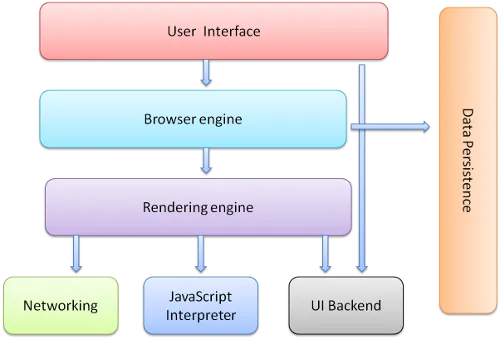
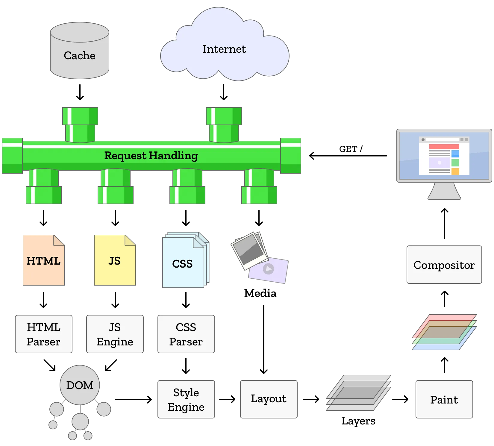
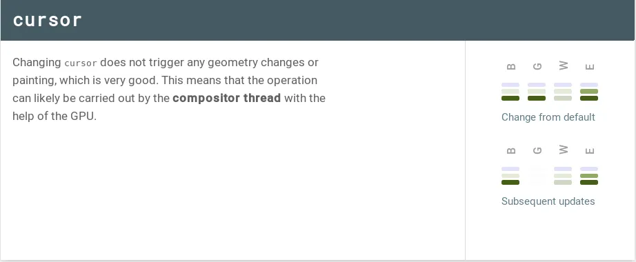
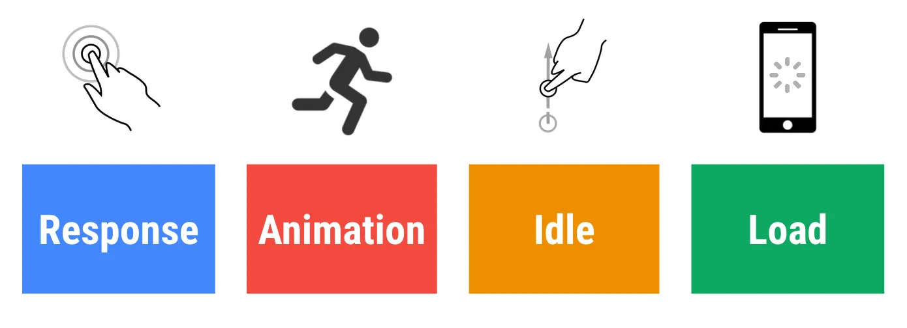
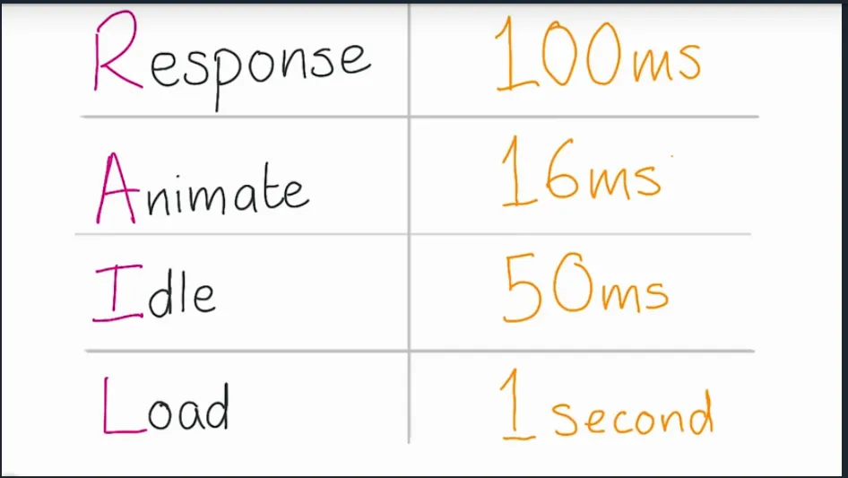
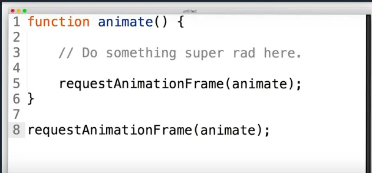
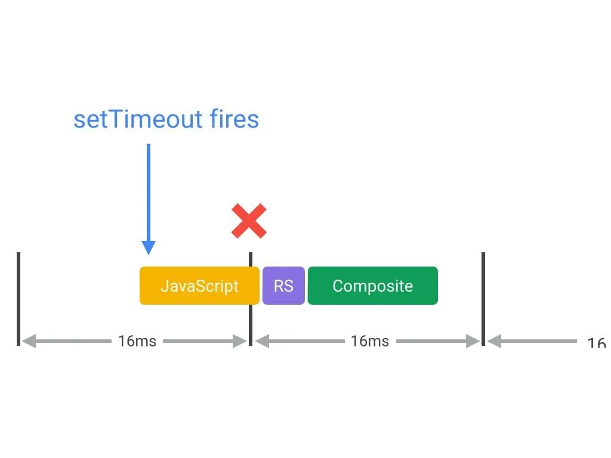
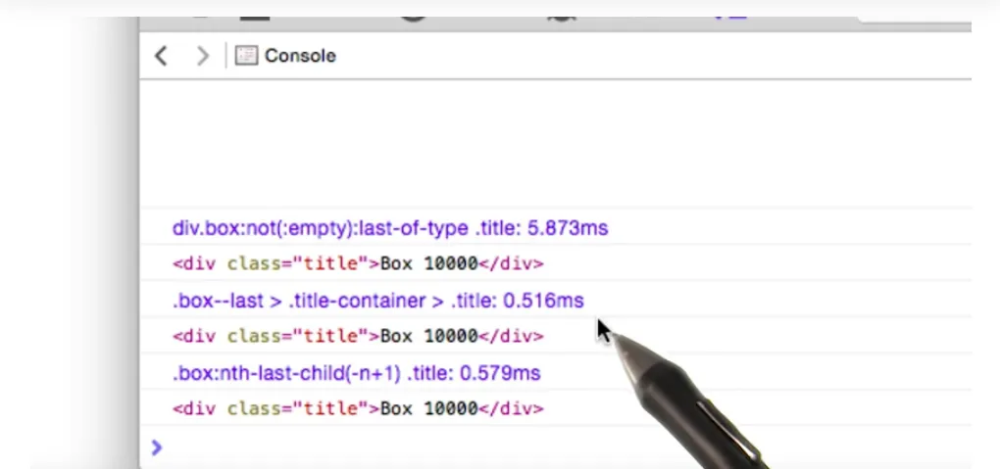
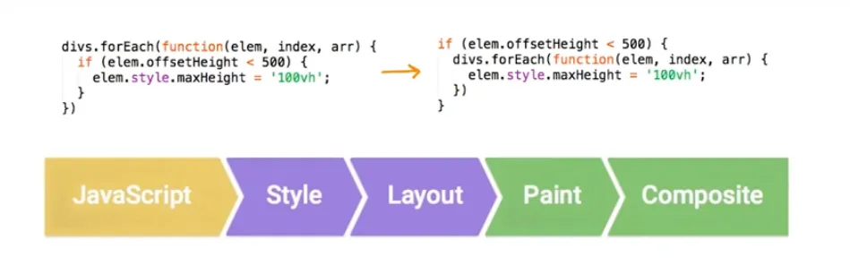

# I’m learning front-end development, again — Part 1 (Browser rendering optimization)

*TLDR; I disregarded front-end development until I started reading about some of its advanced concepts and challenges, I learned more about browser rendering optimization, website performances, and web accessibility. In this article, I’m going to share some notes I took when learning browser rendering optimization.*

<!-- truncate -->

:::note
This blog was originally published on Medium: [I’m learning front-end development, again — Part 1 (Browser rendering optimization)](https://medium.com/@Fcmam5/im-learning-front-end-development-again-part-1-browser-rendering-optimization-c8359ee90c40)

:::

I thought that front-end development was only about making beautiful user interfaces, responsive and mobile-friendly websites that load fast. I imagined that a Front-end Developer was someone who knows more HTML tags, CSS properties and knows how to manipulate DOM with and/or without jQuery, and who knows how things should look and feels when using his applications, and that a front-end developer is only a creative person who knows how to convert mockups to HTML and CSS, who works with React, Angular and Vue.js. And that the backend developer is the smart developer who does the big things in any web application, this one -for me- who’s responsible for the hard part by dealing with a database, Files I/O, authentication, security, and performance...

Apparently, working with HTML, CSS, and JavaScript and designing user interfaces is not that interesting like building backends and dealing with “real challenges”, so why do companies invest in recruiting front-end developers for “Just designing interfaces”? Why front-end development is a separate and well-paid specialty? Looking for an answer, I started a journey of reading and learning “Advanced front-end development” articles and lessons to know how it feels to be a front-end developer, what are their/our challenges, and why there are people specialized in that.

This week, I will be reading and taking notes for what I learned, if it seems complicated, boring or confusing to you, that will be the answer to my questions, it will explain why there are front-end developers, the persons who care about all of that and maybe more!

The journey will be guided by [FrontEnd developer handbook 2018](https://frontendmasters.com/books/front-end-handbook/2018/). So let’s get started in learning front-end development.

First, as front-end developers, we shouldn’t only design beautiful websites. We must take care of things beyond the good-looking design, as specialists and developers, building usable, accessible, and performant web pages is our challenge.

It seems challenging, Nice!<br/>
Let’s get it started.

## Website performances

> Bad performance kills good sites — [Paul Lewis](https://twitter.com/aerotwist) at [ud860](https://classroom.udacity.com/courses/ud860/lessons/4138328558/)

### How browsers works

We can’t optimize or work on websites performances without knowing how the browsers that display their UIs work.


So let’s look under the hood.



Web browsers are composed of a UI, a browser engine that transfers the actions between the UI and the rendering engine, the rendering engine displays the HTML and CSS after parsing it. Browsers also have a data storage layer where data are stored locally as cookies, localStorage, and also IndexedDB, WebsSQL, and FileSystem. There’s also networking (Where HTTP, DNS… are handled), JS interpreter, and UI backend.



### Render Tree

Browser engines parse the HTML and CSS, construct the DOM, calculate the styles and display the web page after composing multiple layers.

After parsing HTML, the browser start constructing the render tree, it’s like the DOM tree with no `<head>` element, no hidden elements by `display:none` and with CSS pseudo-elements added to the tree-like

```css
h1::before {
 content: "Hello Africa";
}
```

Will construct a node like the DOM’s nodes. After this step, CSS will be added alongside media, the web page will be composited by multiple layers.

Read more at:

- [HTML5Rocks : How browsers work](https://www.html5rocks.com/en/tutorials/internals/howbrowserswork/)
- [Quantum Up close: What is a browser engine](https://hacks.mozilla.org/2017/05/quantum-up-close-what-is-a-browser-engine/)

### Optimize the browser rendering

Understanding how “Browsers work” was to learn “How to optimize the rendering process” and to make websites that load and work smoothly. In order to deepen my knowledge and to jump to a practical course, I started [Udacity’s Browser optimization](https://classroom.udacity.com/courses/ud860/) course, where I understood more core concepts of browser rendering. Now, let’s dive into the rendering process.

### 60fps and Device Refresh Rates

Users expect the web page that they are visiting to be interactive and smooth, working on web performance doesn't mean we only need to make pages load fast, but we need to make sure that they are running, scrolling fast, animations should be smooth.

HTML, CSS, and JavaScript are handled by browsers, most devices running these browsers refresh their screens 60 times a second (it means that we have 60FPS or one Frame per 16.6666ms). All our animations should be under a score of 10ms (source: [Google Developers: Rendering performance](https://developers.google.com/web/fundamentals/performance/rendering/)).

In order to achieve that, we must know more about the Pixel pipeline.


- **JavaScript** most of the time, JS is used to make visual changes to our web pages, by adding DOM elements to our pages, changing styles…
- **Style calculations** are the process of calculating what CSS rules to apply on which element based on matching selectors.
- **Layout** is the process of calculating spaces, widths of the `<body>` element, and its children's widths.
- **Paint** is the process of filling in pixels by drawing out texts, colors, images, shadows, and every visual part of each element, drawing is done onto multiple layers.


- **Compositing** is the process of calculating and drawing each element’s order so that the page renders correctly.

We won’t always solicit every part of the pipeline on every frame, the fewer properties are changed the fewer calculations we do.

This part taught me that some tasks are more expensive than others, some CSS properties like changing a certain element’s position may cause Style calculations, Layout calculations, Paint and composite processes and that’s expensive. While changing the `cursor` property won’t affect the layout or painting, it will be carried out by the compositor thread with the help of the GPU.



> Performance is the art of avoiding work, and making any work you do as efficient as possible. — [Google Developers: Rendering performance](https://developers.google.com/web/fundamentals/performance/rendering/).

I learned all these valuable information from:

- [Browser rendering and optimization: Layout and paint](https://classroom.udacity.com/courses/ud860/lessons/4138328558/concepts/41373290750923)
- [Google Developers: Rendering performance](https://developers.google.com/web/fundamentals/performance/rendering/)
- [CSS Triggers](https://csstriggers.com/)

### RAIL (Response, Animate, Idle, Load)

RAIL is a performance model, RAIL’s goals and guidelines help us to ensure a good UX.



In Udacity course, the teachers suggested these metrics.



Users dislike when animations aren’t smooth, with 60 frames rendered every second, animations should be at 16ms per frame. When it comes to response, users want to feel that the results are immediate, any delay between action and reaction is non-accepted.

It is true that mobile users, especially those who are using slow 3G connections, it is a realistic goal to load pages in 5000ms, but they accept to wait for sites to respond to their inputs, not for sites to load. So it is important to load as little data as possible so the user starts using the page while loading the complete extra loadings.


We can also load complex animations upfront (see more about [**F**irst **L**ast **I**nvert **P**lay](https://youtu.be/H3z97NcAbCI)).

At the end of this point, I would like to share with you these useful links by [Google Developers: RAIL Tools](https://developers.google.com/web/fundamentals/performance/rail#tools).

### JavaScript: Understand how it works on the browser then optimize!

JavaScript engines in web browsers interpret the JavaScript utilizing JIT compilers to transform the JS code to byte-code.

Each JavaScript engine implements a version of ECMAScript, a JavaScript dialect and that’s why we have [different browser support for ES6, ES7 …](https://kangax.github.io/compat-table/es6/)

> The goal of a JavaScript engine’s code parsing and execution process is to generate the most optimized code in the shortest possible time. — Jen Looper, [A Guide to JavaScript Engines for Idiots](https://developer.telerik.com/featured/a-guide-to-javascript-engines-for-idiots/)

JavaScript code, could not be optimized by hacking the “micro-optimizations” of the JIT compilers.

So, in order to optimize JavaScript, there are many things we should ensure, one of them is to run JavaScript as earlier as possible at the begging of each frame (that’s why we discussed the pixel pipeline and RAIL).

Modern browsers provide a `requestAnimationFrame` function that schedules JavaScript to run as earlier as possible at the begging of the frame.



Also, when it comes to “JavaScript optimization”, Web workers will be our friends, they allow us to run JavaScript on a totally different thread, they can perform I/O without interfering with the main browser thread, Web Workers can communicate with the main JavaScript code (that created it) by messages. Read more at [Web Worker Documentation on MDN](https://developer.mozilla.org/en-US/docs/Web/API/Web_Workers_API/Using_web_workers).

For example, we gonna pass a string to a worker in workerFile.js the worker will return the message to the main script.

Main script:

```javascript
var worker = new Worker('workerFile.js');

worker.addEventListener('message', function(e) {
  console.log('Worker said: ', e.data);
}, false);

worker.postMessage('Hello World'); // Send data to our worker.
```

And workerFile.js (the worker):

```javascript
self.addEventListener('message', function(e) {
  self.postMessage(e.data.toUpperCase);
}, false);
```

The example is from [HTML5Rocks: The basics of Web workers](https://www.html5rocks.com/en/tutorials/workers/basics/).


When talking about **memory management in JavaScript**, we can only rely on JavaScript’s **garbage collector**, JavaScript doesn't have memory or pointers management functions such as `malloc()` and `free()`, so in this case **Variables Scopes**, and **functions calls**. For example:

When declaring a local variable inside a function, the allocated space for this variable will be freed after using it.

```javascript
function foo(arg) {
    var bar = "this is a local variable";
}
```

But, when using global variables accidentally, we will be using a memory space all the time.

```javascript
function foo(arg) {
    bar = "this is a hidden global variable";
}
```

Another way where global variables could be created accidentally through this when the function is called on the global scope, for example:

```javascript
function foo() {
    this.variable = "potential accidental global";
}

// Foo called on its own, this points to the global object (window)
// rather than being undefined.
foo();
console.log(variable); // will return "potential accidental global" and not undefined
```

*This example is taken from an [auth0 forum article](https://auth0.com/blog/four-types-of-leaks-in-your-javascript-code-and-how-to-get-rid-of-them/).*


Also, sometimes when performing an animation and when working with timers and callbacks, for example `setInterval` is used to perform a certain temporary animation, then it won’t be necessary, let’s check [this example](https://jsfiddle.net/Fcmam5/zswbd3eL/):


```javascript
var clientCountElement = document.getElementById('visitors');
var ourClients = getData(); // returns 100 for example
var clientCounter = 0;
setInterval(function() {
  if (ourClients > clientCounter) {
    clientCounter++;
    clientCountElement.innerHTML = String(clientCounter);
  }
}, 10);
```


When `clientCounter` reaches the `ourClients` the animation will stop, the visitor number won’t be incremented but the callback will continue the execution. So, the timers like `setTimeout` and `setInterval` must be cleared after finishing the desired action. For my example I tried this:


```javascript
var clientCountElement = document.getElementById('visitors');
var ourClients = getData(); // returned 100
var clientCounter = 0;
var animation = setInterval(function() {
      if (ourClients > clientCounter) {
        clientCounter++;
        clientCountElement.innerHTML = String(clientCounter);
      } else {
        // Here we cleanup after finishing our animation
        clearInterval(animation);
        delete animation;
      }
    }, 10);
```

And that created a difference, as in this live preview using [Google Chrome’s Task Manager](https://developers.google.com/web/tools/chrome-devtools/memory-problems/).

<iframe width="560" height="315" src="https://www.youtube.com/embed/epkuTNmH7wc?si=gRuTfCjQSAZdvYar" title="YouTube video player" frameborder="0" allow="accelerometer; autoplay; clipboard-write; encrypted-media; gyroscope; picture-in-picture; web-share" referrerpolicy="strict-origin-when-cross-origin" allowfullscreen></iframe>

Timers also may cause another problem, they may run at the end of the frame so it may cause us a missing frame.



So, the solution for that is “Using `requestAnimationFrame`”. As in this example from [Google developers](https://developers.google.com/web/fundamentals/performance/rendering/optimize-javascript-execution):

```javascript
/**
 * If run as a requestAnimationFrame callback, this
 * will be run at the start of the frame.
 */
function updateScreen(time) {
  // Make visual updates here.
}

requestAnimationFrame(updateScreen);
```

Another memory leak is **Out of DOM references**, for example when storing a table cell node (`<td>`), then deleting the table node from the DOM for some reason. The table will be removed from the DOM, but it will stay in memory, the table cell is a child node of `<table>` and children keep references to their parents, so the reference to the table cell causes the whole table to stay in memory.

* [ECMAScript Compatibility table](https://kangax.github.io/compat-table/)
    
* [A Guide to JavaScript Engines for Idiots](https://developer.telerik.com/featured/a-guide-to-javascript-engines-for-idiots/)
    
* [Why Is JavaScript So Fast? (aka JavaScript Engines — How Do They Even?)](https://www.youtube.com/watch?v=pmtwUOHLgq4)
    
* [Web Worker Documentation on MDN](https://developer.mozilla.org/en-US/docs/Web/API/Web_Workers_API/Using_web_workers)
    
* [HTML5 Rocks: The basics of web workers](https://www.html5rocks.com/en/tutorials/workers/basics/)
    
* [Google developers: Optimize JavaScript execution](https://developers.google.com/web/fundamentals/performance/rendering/optimize-javascript-execution)
    
* [Auth0: 4 Types of Memory Leaks in JavaScript and How to Get Rid Of Them](https://auth0.com/blog/four-types-of-leaks-in-your-javascript-code-and-how-to-get-rid-of-them/)

### CSS optimizations matter too!

When optimizing our web pages, we must take care of CSS too. Using [BEM (Block Element Modifier) methodology](https://en.bem.info/methodology/key-concepts/#bem-entity) is recommended, it’s simpler, reusable, and more optimal. It’s easier for browsers to math CSS classes than to calculate `nth-child(n)`, it seems logical: Matching an element is faster than calculating “Which element it is?” than matching that calculated result.




Also, we must [avoid Forced Synchronous Layout](https://developers.google.com/web/fundamentals/performance/rendering/avoid-large-complex-layouts-and-layout-thrashing#avoid_forced_synchronous_layouts). It’s happened when we force the browser to perform layout earlier with JavaScript, normally the Layout should be changed after style calculations that came after running JavaScript.



FSL (Forced Synchronous Layout) could be even worse, when not avoiding [Layout trashing](https://developers.google.com/web/fundamentals/performance/rendering/avoid-large-complex-layouts-and-layout-thrashing#avoid_layout_thrashing), like we don’t care if we calculate widths, heights, margins and offset each time by calling functions like `.offsetHeight` inside a loop.

For example, this:

```javascript
// Read.
var width = box.offsetWidth;

function resizeAllParagraphsToMatchBlockWidth() {
  for (var i = 0; i < paragraphs.length; i++) {
    // Now write.
    paragraphs[i].style.width = width + 'px';
  }
}
```

Is more optimal than

```javascript
function resizeAllParagraphsToMatchBlockWidth() {

  // Puts the browser into a read-write-read-write cycle.
  for (var i = 0; i < paragraphs.length; i++) {
    paragraphs[i].style.width = box.offsetWidth + 'px';
  }
}
```

Sources:

*   [Google Developers: Avoid Large, Complex Layouts and Layout Thrashing](https://developers.google.com/web/fundamentals/performance/rendering/avoid-large-complex-layouts-and-layout-thrashing)
    
*   [Udacity: Browser rendering optimization](https://classroom.udacity.com/courses/ud860)
  
### Measure first, then optimize


Google Chrome and Firefox provide powerful testing, debugging, and measurement tools. In [Udacity’s course(Under a title of “Weapons of junk destruction”)](https://classroom.udacity.com/courses/ud860) I learned a little to how to measure the performance. Firefox also provides a powerful [Performance measurement tool in his DevTools](https://developer.mozilla.org/son/docs/Tools/Performance).

When working on website performance, we must always measure, at the begging and after performing any modifications, we must not “**Try to solve problems that we don’t have**”.

Somehow, when taking a rest from writing, I visited Facebook where I found that freeCodeCamp posted this great talk!

<iframe width="560" height="315" src="https://www.youtube.com/embed/v5r_n6Tq0uk?si=V3IxwaZYrGZTww35" title="YouTube video player" frameborder="0" allow="accelerometer; autoplay; clipboard-write; encrypted-media; gyroscope; picture-in-picture; web-share" referrerpolicy="strict-origin-when-cross-origin" allowfullscreen></iframe>


<br/>

My first week ends here, and that was what I learned. I really don’t know “How it feels to be a front-end developer”, how do the professional front-end developers work, and do they really care about this? I really want to hear anything from you, the front-end developers especially!

I enjoyed studying this week, I understood the rendering process, and that everything matters. Some of the concepts seemed harder to understand so I looked up to them, I needed more resources to understand them. Trying to take notes about what I’m learning on this article obliged me to do more efforts to understand all that I need to write, and I needed to write all the interesting things I read, so writing was a motivation for me!