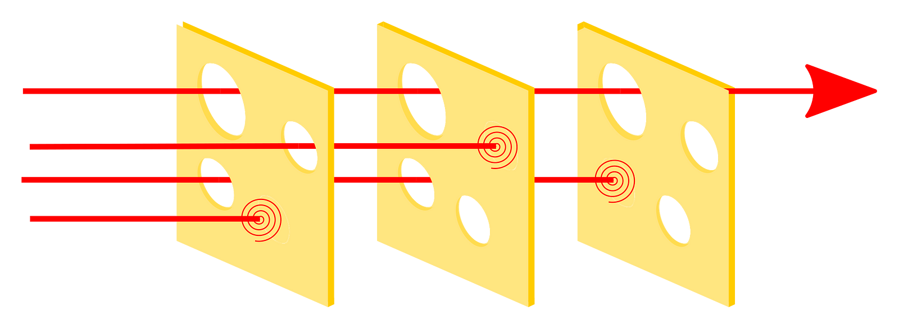
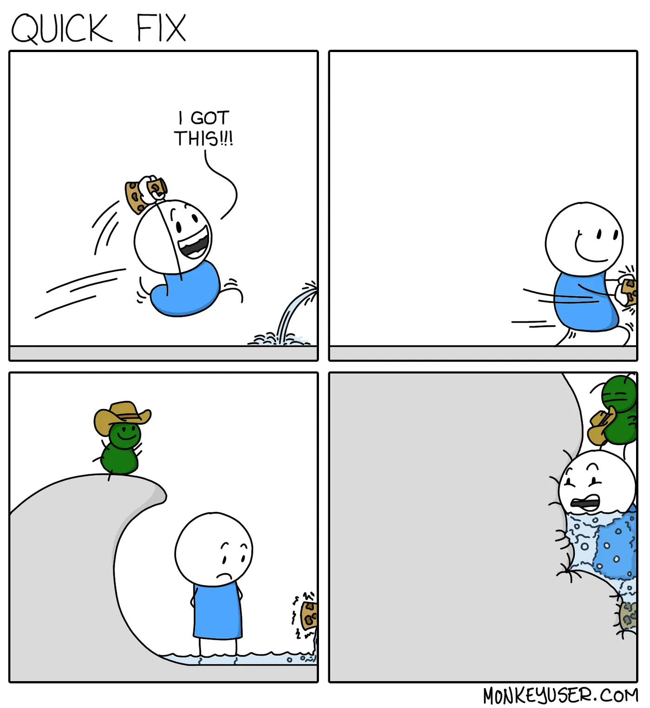

# Trying to become a better developer by learning more about aviation

In the last few months, I started geeking more about aviation-related topics. Mostly by watching A LOT of videos explaining how things work, and how accidents happened in that highly regulated and safe field.

<!-- truncate -->

:::note
This blog was originally published on medium ([Trying to become a better developer by learning more about aviation](https://medium.com/@Fcmam5/trying-to-become-a-better-developer-by-learning-more-about-aviation-5241e7092f7e)), it was - by far - my most popular post ever.
:::

I really don’t know why the aviation domain precisely but, I think it has a sweet spot for me where I learn new things, while I let go of things I don’t understand very well so that I don’t dive too deep into searching and reading. For example, I can understand what “Wake turbulence” is, but I can’t explain it in physics terms, which is fine for a hobbyist.

In a journey to become a better software engineer, I believe it’s necessary to continuously improve my “Engineer reflexes and intuitions”, if I can call it that. It’s basically having that sense that made seniors I worked with say: No I don’t like that solution, I think it will cause XYZ. An answer like that was impressive to me, how could they bring all those exceptions and edge cases to the table and be that proactive?

The answer was partially in the many aviation videos I watched: It’s in training, a lot of training, and in learning about others’ mistakes (because we can’t afford to try them on our own) and in talking and reading, being open and up to date.

In a high-risk field, you would have smart people who are specialists in risk management, and together with engineers and inspectors they usually bring up standards, best practices, and patterns and concepts to follow.

From those concepts, I learned about:

**“Aviate, Navigate, Communicate”** axiom

When things go wrong pilots are trained to focus on actually keeping the airplane in the air, then they navigate. They decide where to go and land somewhere, and only when clearing that out do they communicate with Air traffic controllers, crew members and/or passengers.

We can also adopt similar practices as software engineers, or at least get inspired by them. For example, when dealing with production outages, it is more important sometimes to just keep production running and keep serving the users. Only after ensuring that, we may start looking into debugging and fixing those root causes. One of the most stressful things we go through during incidents is when POs or different managers come (or start calling) to ask for reports asking what happened and what is the estimated time to XYZ.

I believe that engineers should first focus on fixing the problems and then they can jot down a postmortem report, or if possible they would delegate one communicator in the team who will be their only proxy to other parties. The communicator in charge will block the unnecessary panic questions, and will only report the team's findings and not their hypotheses.
If you are an application owner, who needs to communicate to their users, you don't want to communicate what your engineers "think is the reason", or that "the fix may work", you just want to be sure and let your engineers do their jobs properly. So as in aviation: Communicate, comes after Aviate and Navigate.

## Dr. Reason's Swiss cheese model

Airplanes go through rough testing procedures. And before each flight, multiple parties need to check for different parts of the aircraft and its flight program.

Maintenance staff must check the airplanes regularly, and before each flight, the pilots have a mandatory pre-flight check to perform from outside the aircraft and inside the cockpit. Each of these checks is a defense layer, and each layer might not be perfect due to human errors or lack of observations, or maybe the flaws are just hard or impossible to find easily.

This situation where flaws can bypass the many defense layers due to hazards and accidents leads to major accidents happening when all holes of the cheese are lined up which defined what's called a ["Dr. Reason's Swiss cheese model"](https://en.wikipedia.org/wiki/Swiss_cheese_model).

As software engineers, we have multiple defense layers to protect our applications, to ensure that our code is running as expected all the time.

These layers are defined by our code reviews, different test classes, and working with QA, security, and Operation teams.

In more critical environments, regulations may enforce having more layers, more SDLC controls, and even more "bureaucratic" operations to fulfill. This may create an unpleasant and unagile environment for us, the engineers, but it may make sense to protect our organization and our users as much as possible.

## Build for resiliency and designed to fail safely

Airplanes and pilots go through rough tests and simulations to prove their resilience, and even with that aircraft are designed and equipped to crash-land safely, they are equipped to land on water as well as land. Pilots are trained to fly and land in difficult situations that sometimes seem impossible.

As a software engineer, I always strive to build resilient and stable pieces of software, and I try my best to test it and cover as many edge cases as possible with different test suites. Even with that, I set it up to fail safely, it is cheaper to invest time and effort to design graceful shutdown mechanisms, error handling, and alerting system is better than having to debug or resolve issues in darkness when they happen in production.

Admitting that things can go wrong is an act of humbleness and engineering wisdom and an acknowledgment of common fallacies (such as the network being reliable, especially when operating on public Clouds). This makes me prepare for incidents and outages and feel comfortable with breaking things in DEV and staging environments. This will "prove" that other pieces of the system are resilient to continue operating, or at least not causing a domino effect.

As humans, we cannot always make smart decisions when being under stress, we tend to give up on our reflexes. And the only smart way to prepare for chaos is to train ourselves for those moments, to actually program our reflexes to do the "right" things, or at least to not panic and make more incidents look like other any other events happening at the job.

In a great talk by Amazon, this was addressed by AWS's Resilience Engineering team who are trained as firefighters who are trained for hours to handle emergencies.

<iframe width="560" height="315" src="https://www.youtube.com/embed/ztiPjey2rfY?si=PHZiLg1wQ_iCyRn4" title="YouTube video player" frameborder="0" allow="accelerometer; autoplay; clipboard-write; encrypted-media; gyroscope; picture-in-picture; web-share" referrerpolicy="strict-origin-when-cross-origin" allowfullscreen></iframe>

## Checklists, Runbooks, and notes

I learned that pilots have checklists for many scenarios, and they are continually checked and followed even if the pilots are operating the same airplane for long hours and probably flew and landed it hundreds of times, they still follow the same checklists because they don’t want to miss any tiny detail.

These checklists can also cover incidents and what to do when a certain problem occurs, they may cover things that seem obvious to anyone but under stress, tiredness, and confusion they might be missed or done in the wrong way which can be fatal.

In addition to checklists, I learned that pilots communicate and keep a log of their actions, for example when taking off, the pilot will communicate their V1, VR, and V2, then they announce the speed when reaching it during the takeoff.

This is a learning for me as a software engineer, it is good practice to write Runbooks and keep notes whenever possible when designing, developing, and debugging software. This might come in handy to trace back issues or to learn and have the narrative behind decisions that are implemented.

Maintaining troubleshooting guides is crucial to easily and quickly debug and spot common errors that might happen in the past, or that are expected, these guides should be maintained and updated with new learnings and incidents that can be mitigated in the future.

We are humans, we forget a lot and we don’t know how to act well under stress, and also, we can’t always have the same people who debugged a certain problem on-call 24/7, we must learn from them for the best of everyone.

## It’s a Semi-automated environment

Autopilots nowadays are smart, they can fly and land an aircraft, and still, we need pilots to handle some situations manually.

When the autopilot is flying the airplane, the pilot would be more in the monitoring mission. Air traffic controllers as well rely on instruments and “intelligent” software, but we still rely on the human factor to take decisions and to watch these instruments because software can be faulty, or it just cannot cover edge cases (like what happened in [06L at Toronto airport](https://www.youtube.com/watch?v=nj7nG6gJqsU)).

Same as with software engineering, we have a lot of development, debugging, orchestrating, and monitoring tools that can do a lot for us but we still need to manage and configure them and sometimes just do things by ourselves since we might reach their limitations or we have an edge case that wasn’t covered when they were built.

## Have a “Ubiquitous language”

Pilots who fly internationally don’t only have to speak English, but they also have to use unambiguous jargon, they even have to spell important words in [NATO Phonetic alphabet](https://en.wikipedia.org/wiki/NATO_phonetic_alphabet) (Alpha, Bravo, Charlie…). It is expected from any pilots, ATC operator, and investigator to differentiate between a Mayday and a PAN-PAN, to understand what airborne and “hold short” mean.

Similarly, as software engineers, we do have our vocabulary, our wordings, and expressions but we sometimes tend to misuse some of them, or we don’t pay attention to how words can have a huge impact on some of our decisions.

The term “Ubiquitous language” was used by Eric Evans in his book [Domain-Driven Design: Tackling Complexity in the Heart of Software](https://www.amazon.de/Domain-Driven-Design-Tackling-Complexity-Software/dp/0321125215), to define and build a common language between developers and different parties working and using the application, this ubiquitous language, when used in conversations between developers, testers, product owners and domain experts, based on a domain model that evolves with the product and with the team’s understanding of the domain.

The common understanding and using the same common language should also affect the “DoD and DoR”, which always cause friction between business, product, development, and Ops teams. When “Ready” and “Done” definitions are not clear, engineers may start working on tickets with undefined or unclear requirements which may lead to either an incomplete or an overengineered solution. And if the definition of “Done” is not clear, product and business teams may lose track of what the development team is working on, or developers may push incomplete features that might not be signed by QA.

## Design good enough monitoring dashboards

Monitoring aircraft, weather radars, and airports is a vital part of aviation. Sensors and computers are getting smarter and more accurate and that only can help pilots be more proactive, they can spot problems in their early stages and solve them seamlessly. But when technology fails to deliver, pilots’ experience and training come to debug and find optimal solutions to overcome issues.

As software engineers we also care about our health checks, our metrics, and alerts, we may even go a little bit crazy and have verbose logs and over-crowded dashboards of metrics we rarely care about. We can have that as a learning and make sure to have habits to check monitoring dashboards regularly.

As developers, we love tools, we love dashboards, and we all love seeing our health checks green with no crazy spikes when we leave for our weekends. But experience and horror stories showed us that sometimes these monitoring dashboards might not be reliable and most of the time it’s because of the way we set them up, and a few times they’re buggy or affected by infrastructure outages, for example, this:

<iframe width="560" height="315" src="https://www.youtube.com/embed/mrp1F2rezdw?si=WmeRbiD8aiUS9Ufr&amp;start=2278" title="YouTube video player" frameborder="0" allow="accelerometer; autoplay; clipboard-write; encrypted-media; gyroscope; picture-in-picture; web-share" referrerpolicy="strict-origin-when-cross-origin" allowfullscreen></iframe>

This and other lessons taught us that we should invest in having a set of health checks and monitoring dashboards, and all of them need to be carefully set up.

One other thing to consider is that we need to avoid noise when it comes to dashboards, we should have a smart optimal set of metrics and views to monitor or it will be overwhelming to process what’s going wrong by looking at the screen regularly.

## Treat warnings and alerts as WARNINGS and ALERTS!

We are all guilty of ignoring warnings in our applications and different monitoring and scanning consoles. We think that we know that some of them are false positives, irrelevant, not urgent, or just another “not my problem” labeled thing.

After a while we get immune, we stop caring and noticing “real warnings” when they happen so we don’t act on them on time.

Alerts are even more critical, and similarly to aviation fields, if they happen we should **really** react to that, if we ever think that alert is a false positive one, we should try to tag it so we can improve our alerting and monitoring systems. We don’t want to become numb to these alerts so we just ignore them or treat them seriously and react to them in time.

## Simulators

Pilots spend hours training on simulators that are as realistic as it gets before they actually start flying real planes.

And that’s a lesson for us, as expensive as it is to have staging and/or pre-prod environments that are protected and close to production they might be cheaper than dealing with problems in production. These environments must be kept clean and protected as we would treat production to see how our applications can be deployed and run without any hacks or manual interventions from us, while we may lose restrictions on DEV environments and give developers more freedom to experiment and safely break things.

One other lesson we learn from simulators is again: Everyone needs training. We don’t want improvisations and risky fixes on production.

As referred to in the talk I shared from AWS team, they make sure to train their engineers to handle outages so that when that happens they know what to do without panicking (hopefully).

## No matter how experienced you are, take your time learning new tools

A pilot’s experience is evaluated by their flying hours, and when a certain pilot is flying commercially they’re evaluated by their total flying hours and the number of hours they flew on that type (particular airplane model).

As software engineers, we have a big ego, we think we are smart and we know that after years of experience, we can absorb anything new in our ecosystem easily.

As a JavaScript developer, I’m confident that I can switch to any framework and library just by spending a few hours looking into the documentation or by reading other people’s code examples, after all, it’s just JavaScript. However, with that mentality and with some over-confidence I may overlook certain caveats, or certain “good practices” if I don’t pay enough attention to the documentation and give new tools, concepts, and technologies their fair amount of time and focus.

## Take rest, respect your time off if you care about your job

Fatigue is a major factor in many accidents. That made regulators and companies ensure, and enforce having a good amount of rest for pilots.

If pilots operate for long hours or they did not have quality rest they will have poor judgment, decision-making, and flying abilities. This may cause a failure in assessing different flying scenarios and challenges.

While writing this article, one of my favorite aviation channels published this video about my country’s aviation company. It fits perfectly with, this section’s point so I thought I would speak about it here:

<iframe width="560" height="315" src="https://www.youtube.com/embed/o57gCc-_oPY?si=be5JuUCAxeI72K6x" title="YouTube video player" frameborder="0" allow="accelerometer; autoplay; clipboard-write; encrypted-media; gyroscope; picture-in-picture; web-share" referrerpolicy="strict-origin-when-cross-origin" allowfullscreen></iframe>

As software engineers, we do relate to situations where tiredness can cause a fatal accident. How many times have we thought we’d push ourselves and work for extra minutes and ended up creating bugs and incidents that took us hours to fix?

The moral of this was synthesized in Uncle Bob’s Clean Coder book:

> “Don’t write code when you are tired. Dedication and professionalism are more about discipline than hours. Make sure that your sleep, health, and lifestyle are tuned so that you can put in eight good hours per day.” — Robert C. Martin (Uncle Bob), The clean coder

And:

> “If you are tired or distracted, do not code. You’ll only wind up redoing what you did. Instead, find a way to eliminate the distractions and settle your mind.” — Robert C. Martin (Uncle Bob), The clean coder

One other trap we may fall into is that “if I ever stop here I would forget where I stopped” or something like “I’m sick of this and I want to start my next day by working on something other than this” And we end up rushing, designing and writing things we forget due to fatigue later and might also clumsy and be of low quality.

> “Can’t go home till you solve this problem? Oh yes you can, and you probably should! Creativity and intelligence are fleeting states of mind. When you are tired, they go away. If you then pound your nonfunctioning brain for hour after late-night hour trying to solve a problem, you’ll simply make yourself more tired and reduce the chance that the shower, or the car, will help you solve the problem.
> When you are stuck, when you are tired, disengage for awhile. Give your creative subconscious a crack at the problem. You will get more done in less time and with less effort if you are careful to husband your resources.” — Robert C. Martin (Uncle Bob), The clean coder

I learned that taking time off and having real weekends and vacations is an investment in your professional life. In your time off, you don’t work, don’t think about work, and only care about your health, family, and enjoying your time. Once you are back, you will find yourself more motivated, more focused and, your passion or your interest refreshed.

