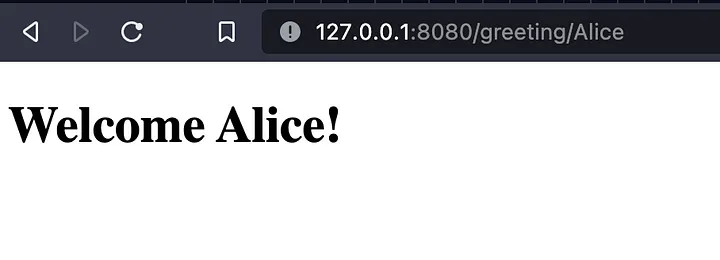
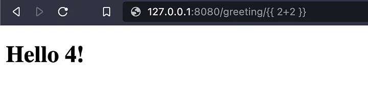
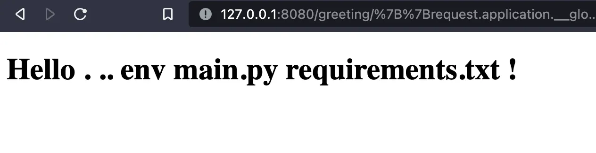
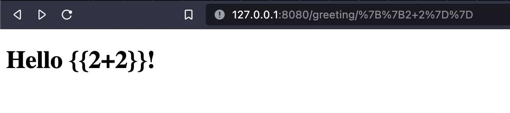

# CTF as a developer (Pt. 1): Template engines & SSTI

Being a software developer is a responsibility, it’s a job where we provide secure and stable services and infrastructure to users who trust us (or trust regulations that ensure we are trustworthy).

To learn more about cybersecurity principles, and why some “best practices” matter, I decided to play some CTF challenges instead of only relying on reading articles and scrolling into OWASP top 10’s documentation.

My beginning was with HackTheBox. For some reason, some of the challenges I did had [Server-side Template Injection (SSTI)](https://owasp.org/www-project-web-security-testing-guide/stable/4-Web_Application_Security_Testing/07-Input_Validation_Testing/18-Testing_for_Server-side_Template_Injection) vulnerabilities which I’m starting this blog series with.

<!-- truncate -->

> If you are a security professional or an experienced programmer this article might not bring you anything new, feel free to stop reading now, but I would appreciate your inputs, corrections and guidance!

:::note
I published this article previously on Medium: [CTF as a developer (Pt. 1): Template engines & SSTI](https://medium.com/@Fcmam5/ctf-as-a-developer-pt-1-template-engines-ssti-b03c59e2c095)
:::

## What are template engines?

Template engines are tools that facilitate rendering content for web applications by injecting data into static templates.

Template engines like [Jinja](https://github.com/pallets/jinja), [Handlebars](https://handlebarsjs.com/), [EJS](https://ejs.co/), or PHP’s [Twig](https://twig.symfony.com/) provide more features for developers to add more logic (with variables, functions, loops, etc.) to templates which makes development and maintenance easier.

## Server-side template injection (SSTI) vulnerabilities

Consider this simple, and ugly app that greets the user every time they visit our `/greeting/<name>` route:

```python
from flask import Flask, render_template_string
from random import choice

app = Flask(__name__)

@app.route("/greeting/<name>")
def greeting(name):
    greeting = choice(["Hi", "Hello", "Welcome"])
    template = '''
    <!DOCTYPE html>
    <html lang="en">
    <head>
        <meta charset="UTF-8" />
        <title>Greeting</title>
    </head>
    <body>
        <h1>''' + greeting + ' ' + name + '''!</h1>
    </body>
    </html>'''
    return render_template_string(template)

if __name__ == '__main__':
    app.run(debug=True,port=8080)
```

For example, `GET /greeting/Alice` would show:



Now that we (or attackers) know that we are passing a user-provided variable to the template, we can experiment by passing a Jinja2 expression `{{ 2 + 2 }}`. In my case that would show:



This means that the expression was evaluated as a Jinja template, which means that attackers can inject Python code that can do anything, for example running an `ls -R` on the application server’s shell with an expression like the following:

```python
{{request.application.__globals__.__builtins__.__import__('os').popen('ls -R').read()}}
```

Which will show:



Attackers can be creative from here, they can run any command to upload/download more malicious scripts to our application servers which will give them more access and make things far easier for them.

The risks of such an attack are high, especially since even skiddies may use free scripts and tools that are available online to scan and exploit websites. The magical command:

```python
request.application.__globals__.__builtins__.__import__('os').popen('ls -R').read()
```

Can be found in serval blogs online along with other tricks for more powerful exploits. That means that anyone can exploit it, so please let’s take it seriously.

Security professionals and threat actors also rely on tools (such as [tplmap](https://github.com/epinna/tplmap)) to find and exploit real-world applications, which makes SSTI vulnerabilities critical to solve as they might be easy to find and exploit.

## Why should I even care?

Even if you are building a small side-project, you really have to not neglect basic security aspects.

Threat actors may use your applications’ servers as nodes in their botnets, or use them as proxies when performing attacks on more critical targets.
Or they would make your application server into a crypto-miner, or a platform to run their CPU-expensive applications.

You really don’t want to have unnecessary cost and legal implications for just neglecting good practices.

## Remediation

There are plenty of articles online by security professionals who’d tell you how to protect yourself from SSTI and this one would only give typical recommendations:

### NEVER trust client-side validation

Client-side validation is for real application users, it offers guidance and early feedback if they insert any invalid input. It can never block any attack as it can easily bypassed with different techniques.


As trivial as it sounds to any experienced developer or any security professional reading this, we still can find unprotected endpoints.

The absence of server-side validation might happen if applications are built by inexperienced and junior developers (WRITING about it, since I’m guilty of this), or it may also happen correctly if front-end and backend developers are not aligned which would produce inconsistencies in validation rules.

### Use well-maintained and known template engines

Sometimes [Linus’s law](https://en.wikipedia.org/wiki/Linus%27s_law) applies; given enough eyeballs looking at a particular code, bugs and security issues will be discovered.

Template engines like Jinja, EJS, or Twig are maintained by many smart developers who try to maintain them while keeping them safe.

If you are working on an application that would go to production, consider using stable and well-maintained libraries and keeping them up-to-date as they will always provide patches to any possible CVEs.

### Read the documentation

Good libraries are well-documented by the people who built them, and who are using them. You should always rely on the official documentation and not only blog articles and copying around code snippets from StackOverflow or some AI-generated tools.

Sometimes, defaults are evil, and sometimes they are “the safest” option. Only a wise developer can understand how things work and how they should be used.

For example, my previous demo wouldn’t work if I just used [flask.render_template_string](https://flask.palletsprojects.com/en/2.3.x/api/#flask.render_template_string) correctly by passing my variables as parameters and letting it synthesize the rendered expression

```python
def greeting(name):
    greeting = choice(["Hi", "Hello", "Welcome"])
    template = '''
    <!DOCTYPE html>
    <html lang="en">
    <head>
        <meta charset="UTF-8" />
        <title>Greeting</title>
    </head>
    <body>
        <h1> {{ greeting }} {{ name }}!</h1>
    </body>
    </html>'''
    return render_template_string(template, greeting=greeting, name=name)
```

Then the passed value will be synthesized, and rendered as a string



### Sanitizing inputs

Not trusting any user-provided input by validating and sanitizing is a general rule when building applications.

One other piece of advice is to use libraries, and not overengineer another sanitization and/or validation library unless you have a very specific use case and enough resources to build it. It is hard to list and cover all possible scenarios and tricks by yourself.

### Don’t guide attackers

Unless you reveal your technology stack or maintain an open-source application, attackers will scan your application to find which technology you are using before they try to exploit it.

There are plenty of template engines out there, and only by finding which technology is used in rendering them, attackers will save a lot of time that we would take in scanning and brute-forcing.

To hide which backend technology is used in your backend, or at least your front-end rendering service, we can follow these recommendations:

- Make sure to not log any debug messages on the front-end and disable debug mode in your framework.
- Use non-standard framework error pages/messages, consider catching errors and returning your custom error pages. You can make them static (not rendering any variable or expression) unless you can really justify it.
- Remove `X-Powered-By`, `Server`, and any other HTTP headers that would expose your application server (e.g. `X-AspNet-Version`), or just a library like [Helmet](https://helmetjs.github.io/) for Node.js.

### Do not trust your client-facing renderer application

If you are working on a critical application, you might be already applying a zero-trust system which would also affect your application deployment and architecture.

In case your renderer application is containerized, you can consider using distroless images which is a minimalistic setup for your application (removing shell and its utilities) which would limit what can be done if someone took over your application.

Running application processes as a non-root user, and having its filesystem set to read-only in addition to limiting its network access to internal infrastructure.

That may protect the infrastructure from having a backdoor in the renderer.

## Final thoughts

We humans are the most vulnerable piece of any complex software system. We can introduce serious security flaws by being lazy or not taking things seriously or by sacrificing best practices for the sake of speed of delivery.

SSTI is an example of vulnerabilities that might be easy to avoid by just educating ourselves that it’s a risk, by spending some time adapting well-maintained templating engines and keeping them up-to-date or at least updating them when security patches are released.

Adapting templating engines should be done with best practices and security by default. Then developers should have a good code review culture to make sure that libraries are used and configured as they should be.

If you are reading this blog and you are also one of us, who only learn by doing and by breaking things, have a look at these challenges from HackThe box:

- https://app.hackthebox.com/challenges/395
- https://app.hackthebox.com/challenges/152

Or, you can use these applications that are explicitly made to be vulnerable:

- https://owasp.org/www-project-juice-shop/
- https://github.com/OWASP/NodeGoat
- https://github.com/appsecco/dvna
- https://github.com/CTFd/CTFd

Or this lab from PortSwigger’s [Web Security Academy](https://portswigger.net/web-security):

https://portswigger.net/web-security/server-side-template-injection/exploiting

### Resources

- https://owasp.org/www-project-web-security-testing-guide/stable/4-Web_Application_Security_Testing/07-Input_Validation_Testing/18-Testing_for_Server-side_Template_Injection
- https://www.vaadata.com/blog/server-side-template-injection-vulnerability-what-it-is-how-to-prevent-it/
- https://portswigger.net/research/server-side-template-injection