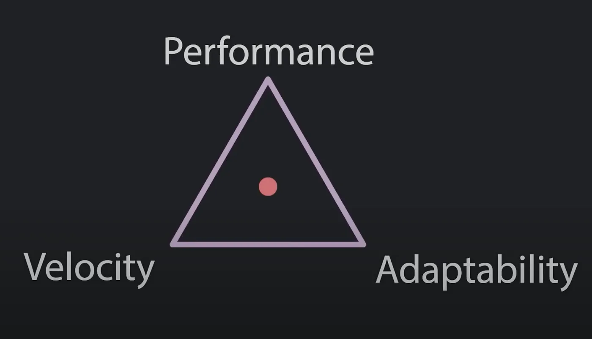

# Avoiding NestJS performance bottlenecks

I have been using [NestJS](https://nestjs.com/) for quite some time now. And as every JavaScript developer, I like to complain about it but I still love it, and I still have it as one of my go-to whenever I want to create any Node application.

<!-- truncate -->

NestJS helps you enjoy a good developer experience, especially if you are a proponent of OOP, and/or you are working with people who are used to other frameworks like Angular, or coming from a Java/Spring background.

NestJS implements [its dependency injection framework](https://github.com/nestjs/nest/blob/master/packages/common/decorators/core/injectable.decorator.ts), which allows an easy abstraction of dependencies making code easier to maintain, test, and swap third-party libraries.

With its powerful [CLI](https://docs.nestjs.com/cli/overview), NestJS bootstraps applications in record time, it also comes with pre-configured modules, or installable plugins making it pleasant to work with and a powerful beginners-friendly tool.

:::note
I published this article previously on Medium: [Avoiding NestJS performance bottlenecks](https://medium.com/@Fcmam5/avoiding-nestjs-performance-bottlenecks-78fa2bc66372)
:::

However, “[With great power comes great responsibility](https://youtu.be/377VhCOtoDA)” and NestJS is not an exception to Uncle Ben’s quote.

Nest’s “fancy” configuration is sometimes more fun to develop, but it sometimes causes performance bottlenecks. Especially when we start customizing things out of the framework’s way of doing them, then things can get ugly easily.

Here are some of the things I learned over the last few years:

## Carefully upgrade to newer NestJS and Node.js versions

The Node.js community is active and continuously working on improving the ecosystem, and now thanks to [a performance-focused team](https://github.com/nodejs/performance) our beloved JavaScript runtime is getting faster and more performant.

One of the performance wins I could achieve was by simply bumping my runtime version from 14 to 16 and then to 18 while making little to no changes to my NestJS microservices code.

Similarly, the NestJS became more stable. With [few](https://github.com/nestjs/docs.nestjs.com/blob/00a3eaa6ee48d072427805efba7b3d7c19cc74fd/content/migration.md) breaking changes from v8.x to 10.x, I feel more comfortable keeping up with new major releases to benefit from the new performance improvements, CVE patches, and bug fixes.

## The logger

NestJS comes with a default [logger which is used by default `process.stdout.write`](https://github.com/nestjs/nest/blob/67951ff2e9b7f4803856ab8169e23350e49d7dfc/packages/common/services/console-logger.service.ts#L221).


`process.stdout` and `process.stderr` is not advised to be used in logging as it may behave synchronously and block the event loop, as the [Node.js documentation states](https://nodejs.org/api/process.html#a-note-on-process-io):


> **Warning:** *Synchronous writes block the event loop until the write has completed. This can be near instantaneous in the case of output to a file, but under high system load, pipes that are not being read at the receiving end, or with slow terminals or file systems, it’s possible for the event loop to be blocked often enough and long enough to have severe negative performance impacts. This may not be a problem when writing to an interactive terminal session, **but consider this particularly careful when doing production logging to the process output streams**.*

Gladly, the logger [can be easily customized](https://docs.nestjs.com/techniques/logger#use-external-logger) and replaced by dedicated logging libraries such as [nestjs-pino](https://github.com/iamolegga/nestjs-pino) and [nest-winston](https://github.com/gremo/nest-winston) which also offer more flexibility and better performance. NestJS documentation covers that well.

However, even when using custom loggers there are some things to consider.

### Startup logger

Even if you use a custom logging library, you’d still have the first few logs printed in Nest’s standard standard form. As NestJS will start streaming application start logs before the logger is attached, that not only may lose crucial framework setup logs from being hidden from logging dashboards but also impact the startup time with few MS.

For example, I usually go for [Pino](https://github.com/pinojs/pino) (with [nestjs-pino](https://github.com/iamolegga/nestjs-pino)) as my logging library, my `main.ts` have:


```typescript
import { NestFactory } from '@nestjs/core';
import { AppModule } from './app.module';
import { Logger } from 'nestjs-pino';

async function bootstrap() {
  const app = await NestFactory.create(AppModule);
  app.useLogger(app.get(Logger));

  await app.listen(3000);
}
bootstrap();
```

This produces a mixed log format as the following:

```json
[Nest] 89914  - 09/16/2023, 2:25:41 AM     LOG [NestFactory] Starting Nest application...
[Nest] 89914  - 09/16/2023, 2:25:41 AM     LOG [InstanceLoader] AppModule dependencies initialized +16ms
[Nest] 89914  - 09/16/2023, 2:25:41 AM     LOG [InstanceLoader] LoggerModule dependencies initialized +0ms
{"level":30,"time":1694823941975,"pid":89914,"hostname":"Fcmam5","context":"RoutesResolver","msg":"AppController {/}:"}
{"level":30,"time":1694823941978,"pid":89914,"hostname":"Fcmam5","context":"RouterExplorer","msg":"Mapped {/, GET} route"}
{"level":30,"time":1694823941980,"pid":89914,"hostname":"Fcmam5","context":"NestApplication","msg":"Nest application successfully started"}
```

The fix would be just buffering logs by setting `bufferLogs` to `true`:

```typescript
import { NestFactory } from '@nestjs/core';
import { AppModule } from './app.module';
import { Logger } from 'nestjs-pino';

async function bootstrap() {
  const app = await NestFactory.create(AppModule, { bufferLogs: true });
  app.useLogger(app.get(Logger));

  await app.listen(3000);
}

bootstrap();
```

This makes sure all logs will be buffered until the custom logger is attached and then logged in its format (`nestjs-pino` in this case), so I would have something like:

```json
{"level":30,"time":1694858121769,"pid":97585,"hostname":"Fcmam5","context":"NestFactory","msg":"Starting Nest application..."}
{"level":30,"time":1694858121770,"pid":97585,"hostname":"Fcmam5","context":"InstanceLoader","msg":"AppModule dependencies initialized"}
{"level":30,"time":1694858121770,"pid":97585,"hostname":"Fcmam5","context":"InstanceLoader","msg":"LoggerModule dependencies initialized"}
{"level":30,"time":1694858121770,"pid":97585,"hostname":"Fcmam5","context":"RoutesResolver","msg":"AppController {/}:"}
{"level":30,"time":1694858121770,"pid":97585,"hostname":"Fcmam5","context":"RouterExplorer","msg":"Mapped {/, GET} route"}
{"level":30,"time":1694858121770,"pid":97585,"hostname":"Fcmam5","context":"NestApplication","msg":"Nest application successfully started"}
```

Note that for standalone applications [you may need to flush log buffers manually](https://github.com/iamolegga/nestjs-pino#logger-substitution).

## Injection scopes

We had a use case where we wanted to inject a [correlation ID](https://microsoft.github.io/code-with-engineering-playbook/observability/correlation-id/) into our logs to keep track of what was happening in our application for a particular request.

The naïve approach I was about to use, was to implement a [request-scoped](https://docs.nestjs.com/fundamentals/injection-scopes#request-provider) instance of the logger, something like:

```typescript
import { Injectable, Scope, Inject} from '@nestjs/common';

@Injectable({ scope: Scope.REQUEST })
export class SomeBrokenLoggingService {
  ...

  log(message) {
    callCustomLoggingLib({reqId: this.getCorrelationID(), message })
  }
}
```

Then I learned how bad that call was, I overlooked the fact that this approach means that I will be instantiating a new instance `SomeBrokenLoggingService` for each request, that would impact my application performance (see: [injection-scopes#performance](https://docs.nestjs.com/fundamentals/injection-scopes#performance)).

The learnings I got from that were:

1. To use a well-maintained library to do that for me.
2. To be more careful with Injection scopes.
3. Consider using [async local storage](https://docs.nestjs.com/recipes/async-local-storage) for some use cases (recently added, thanks NestJS community!).

For example, [nestjs-pino](https://github.com/iamolegga/nestjs-pino#faq) uses [AsyncLocalStorage](https://nodejs.org/api/async_context.html#async_context_class_asynclocalstorage) (previously relied on [cls-hooked](https://www.npmjs.com/package/cls-hooked) package).

## Use Fastify

Made by Node.js maintainers who worked on performance, Fastify [has proven its performance](https://fastify.dev/benchmarks) and it’s making its way to compete with Express to be the most popular Node.js framework.

NestJS comes by default with [Express platform](https://www.npmjs.com/package/@nestjs/platform-express), but it can be easily switched to Fastify, and the documentation did a great job explaining it on the [“Performance (Fastify)” page](https://docs.nestjs.com/techniques/performance#performance-fastify).


The switch from Express to Fastify can be done easily if your codebase is not relying on Express-specific code (as it should be if done à la NestJS), you may only change req/res types from Fastify’s Request and FastifyReply interfaces and probably have to replace the usage of some packages like helmet [to use helmet/fastify](https://docs.nestjs.com/security/helmet#use-with-fastify).

## Other things to consider

Rule #0: **MEASURE!**

Before blaming the framework, we should make sure that our code is performant, that our usage of third-party components is efficient, and that our database queries are efficient.


Then we may start looking into other framework-related micro-optimizations:

- Global pipes, middlewares, guards, and filters might not be always a good idea.
  They sometimes run unnecessary code for endpoints that don’t need their transformations.
- Use lazy loading if it’s relevant to your use case.
  Lazy loading defers module registration by loading them asynchronously to decrease application startup time (which might make sense in a serverless environment).
- If you are using the config module, and accessing environment variables using `process.env` might be slow, cashing can be a solution, see: [Cache environment variables](https://docs.nestjs.com/techniques/configuration#cache-environment-variables).

## Final thoughts

It might be unfair to compare NestJS to Express, Hapi, Koa, or Fastify. We will find out that it’s either slow, has a bigger memory footprint, or uses more CPU. That makes sense.

NestJS takes care of a lot of things by default to offer a good and *“flexible”* developer experience with its built-in libraries and configurations making [micro-sacrifices of performance](https://stackoverflow.com/a/48226084/5078746), which can be accepted.


[](https://youtu.be/tKbV6BpH-C8)

Premature optimization is evil, and if one really can spot performance decrease; Analysis must be done first, by applying the [20-80% rule](https://en.wikipedia.org/wiki/Pareto_principle), we may figure out that most performance hits are not directly related to the framework, but our code, our logic and the way we interact with third-parties.

We should first find the bottlenecks that are decreasing performance the most, fix them, monitor and then consider if it makes sense to push for more micro-optimizations.
