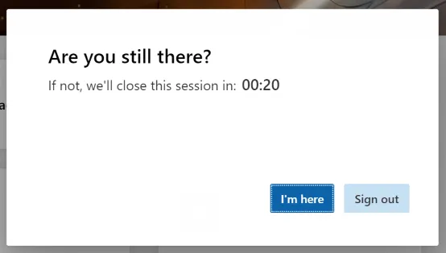
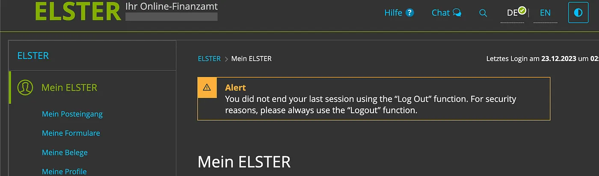

# Why you should kick idle users out of your website

If you use any applications that handle sensitive information, you might already have a situation where you get a countdown before you get logged off, this happens if you don’t interact with the website after a certain (short) period.

Streaming platforms also ask you if you are still watching before they stop the video or navigate to the next episode.

<!-- truncate -->

Does this feature harm the user experience? Or does it improve it?
Is it really necessary? This will bring more complexity to implement, test, and maintain.

Or seriously, when this feature is a must-have and how to present it in the least frustrating format to the users.

What if the user wants to disable this feature?

 

Of course, the answer to all those questions is: It depends.

Let me enumerate some arguments and situations where force-logging off the users would be needed.

> TLDR; Regulations, to protect user privacy, for security reasons, possibly for your resource management and for keeping meaningful analytics.

:::note
I published this article previously on Medium: [Why you should kick idle users out of your website](https://medium.com/@Fcmam5/why-you-should-kick-idle-users-out-of-your-website)
:::

## The “WHY”?

If we understand the arguments to do this, we may decide if we should care to implement this or not.

> **Spoiler alert:** No you don’t have to do it always, just use short-lived authentication sessions/tokens.

### 0. Privacy

Users might not follow basic cyber hygiene principles, leaving their devices unlocked and unattended. They may keep their browser tab open to your super-sensitive website. Any unauthorized access to their devices means definite access to their open accounts and active sessions.

If your super-sensitive website implements a feature that checks if the user is idle and logs them out, you might reduce the risk of having unauthorized access or leaking sensitive information from your user’s account.

### 1. Security

Unauthorized access to one of the users’ accounts may not only cause harm to their data, but it would also be a risk to other users as threat actors will use their victim’s persona/account in their actions.

That also may put your application at a higher risk as you’ll have to deal with users who already are one step further in your system, and who already have valid authentication tokens and valid external-facing API keys. That would expose them to more features of your application and possibly a larger attack surface.

### 2. Resource management

You probably saw a prompt on [Netflix](https://help.netflix.com/en/node/114059) or [YouTube](https://support.google.com/youtube/answer/12819304?hl=en) asking you if you are still watching a video. Or you get a refresh button in your favorite social media platform to refresh content (or login again) after being AFK for a while.

Streaming content is expensive, and it puts a load on both the backend and heavy clients.

No one wants to maintain multiple open connections from their load balancers to users who are not consuming content.

### 3. Compliance and regulations

It is no surprise, that regulators require logging off inactive users after a moment of inactivity. For example, PSD 2 regulation for example requires logging out the user if they’re inactive for 5 minutes:

> *The automatic logout after five minutes of inactivity is a regulatory requirement for banks and payment service providers under the PSD 2 regulation to increase security in online banking. See article 4(3)(d) of the DELEGATED REGULATION (EU) 2018/389 (RTS), https://eur-lex.europa.eu/legal-content/EN/TXT/PDF/?uri=CELEX:32018R0389&from=EN (“the maximum time without activity by the payer after being authenticated for accessing its payment account online shall not exceed 5 minutes.”). [[commerzbank](https://cbportal.commerzbank.com/portal/en/fi/de/system-1/zahlungsdiensterichtlinie_2.html)]*

This imposes on payment services to implement this feature to be compliant, which is a non-negotiable argument.

### 4. Getting "better" analytics

User session times, length of videos watched, number of active users, and similar metrics might give valuable information on how clients are consuming your products and/or using your platform.

## The “How”?

Throughout the article I used “the feature” or “kick the user if they’re idle” or similar expressions.

This feature can be implemented on both the backend and/or front-end. On the backend, you would invalidate idle user sessions (see [OWASP recommendation](https://cheatsheetseries.owasp.org/cheatsheets/Session_Management_Cheat_Sheet.html#idle-timeout)).

The front-end solution would be done by capturing each user’s activity through events like:

- Key presses
- Mouse move
- Clicking
- Scrolling
- Window resize

Then have a timer that we actively reset when the user is active (reset the timer if a new event is triggered).

This part can be easily implemented from scratch (as you already know), or by using the [new **experimental** browser idle APIs](https://developer.mozilla.org/en-US/docs/Web/API/Idle_Detection_API), or [hamid.js](https://www.npmjs.com/package/hamid.js) library (more on this later).

If a user is idle, there should be presented a prompt component with a timer to remind them to react in case they want to keep their session open.

If they are logged off, it would be beneficial to present them with a flash message to inform them that they were logged off.

A similar alert would train the users on the “best practices”.

### A word on Hamid.js

A couple of months ago I wrote [Hamid.js](https://github.com/Fcmam5/hamid.js), a lightweight open-source library to trigger actions if a user is inactive.

For example, if you want to logout a user after 5 minutes of being inactive:

<iframe height="300" width="100%" scrolling="no" title="Hamid.js" src="https://codepen.io/Fcmam5/embed/mdodKVN?default-tab=js" frameborder="no" loading="lazy" allowtransparency="true" allowfullscreen="true">
  See the Pen <a href="https://codepen.io/Fcmam5/pen/mdodKVN">
  Hamid.js</a> by Fortas Abdeldjalil (<a href="https://codepen.io/Fcmam5">@Fcmam5</a>)
  on <a href="https://codepen.io">CodePen</a>.
</iframe>

The library listens by default to a [set of events](https://github.com/Fcmam5/hamid.js/blob/127b7b5d7f66aa2ffa922695589737ff8b7b0904/src/lib.ts#L35) to determine if the user is active, if none of these events is triggered within the configured time interval (second `Hamid` constructor parameter, or 5mins by default), the callback we provide as a first parameter will be triggered.

The library will be improved and possibly rewritten to be extensible to support more than web browsers’ events. Of course, all PRs and contributions are welcome!

> The name is inspired from an Algerian meme originated from a comedy show where a bus driver asked his ticketsman to kick someone else from the bus by saying: Hamid, Serhah (release him).
>
> 

## Final thoughts

In some cases, we would sacrifice having a “seamless” user-experience and easier implementations to provide the users something that we consider better, or at least, more secure.

This article is based on my experience as a developer, and as a lazy user, I hope it receives feedback from smarter people and hopefully, we enrich it together.

