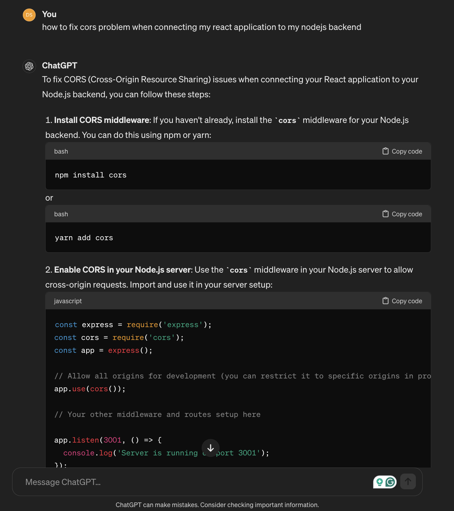
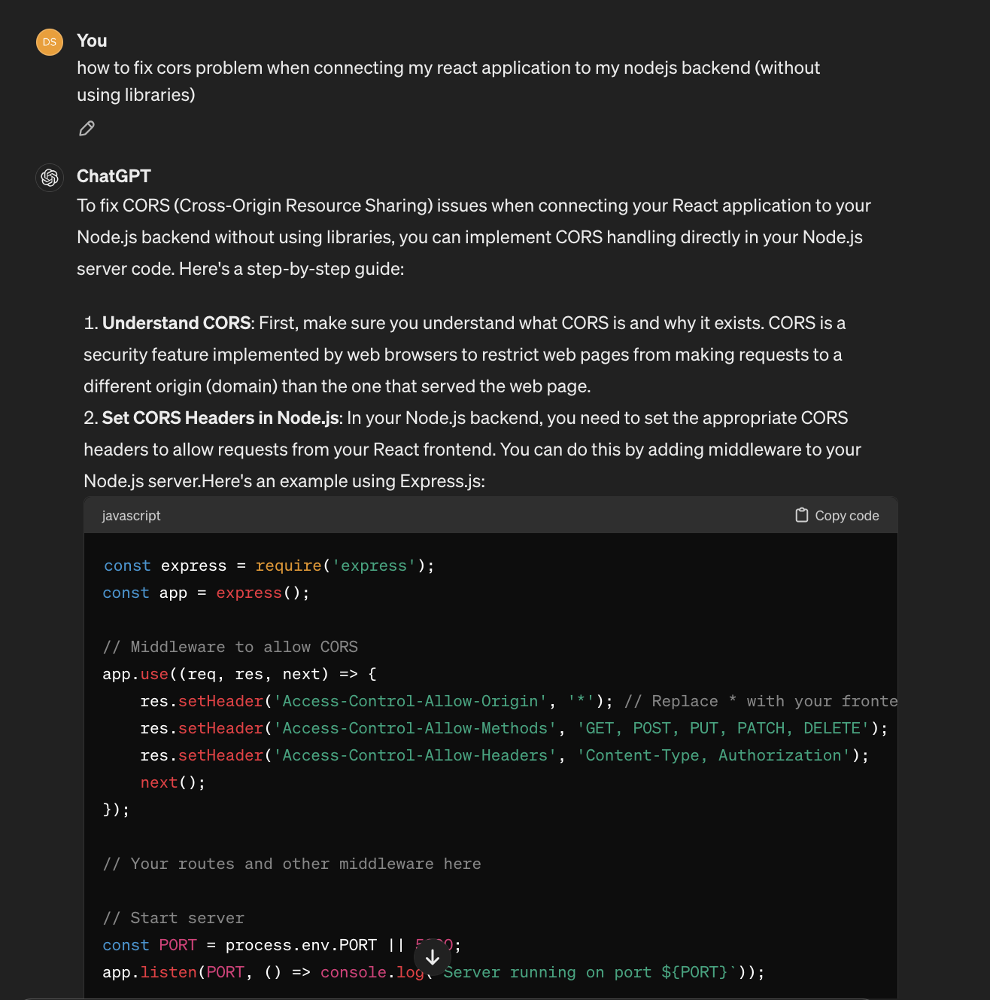

# Breaking CORS by "trying to fix it"

Okay, that's another article about CORS on the internet.

CORS errors are definitely one of the most frustrating errors we face when working on web applications. I don't know what HTTP wizard or how expert you are, but I am sure that you definitely react like Michael Scott here:


<small>
*Meme shamelessly stolen from [this blog](https://fatimamo.com/become-a-cors-wizard)*
</small>

We may break "CORS" or at least break the security barriers it adds by trying to fix it (without understanding it correctly).

<!-- truncate -->

According to [MDN](https://developer.mozilla.org/en-US/docs/Web/HTTP/CORS):

> **Cross-Origin Resource Sharing (CORS)** is an [HTTP](https://developer.mozilla.org/en-US/docs/Glossary/HTTP)-header based mechanism that allows a server to indicate any [origins](https://developer.mozilla.org/en-US/docs/Glossary/Origin) (domain, scheme, or port) other than its own from which a browser should permit loading resources. CORS also relies on a mechanism by which browsers make a "preflight" request to the server hosting the cross-origin resource, in order to check that the server will permit the actual request. In that preflight, the browser sends headers that indicate the HTTP method and headers that will be used in the actual request.

Now, before you scroll down this article looking for examples where I show you how to carelessly allow all origins to make your new shiny React or Vue application "work", let's ramble for a little bit, and try to make the web a better place.

## The problem with CORS

The problem with CORS is **YOU**, **ME**, and the over-simplified tutorials on the internet.

[Same-origin](https://developer.mozilla.org/en-US/docs/Web/Security/Same-origin_policy) is a security barrier that restricts resources from being loaded by one origin.

This policy helps reducing attack vectors by isolating malicious resources.

[CORS](https://developer.mozilla.org/en-US/docs/Web/HTTP/CORS) is a way to "*lift that barrier*" by allowing cross-origin access (`C O` in `CORS` as you guessed correctly).

It is a way where your client can load data only from whitelisted origins. For example, if you have a backend API being served from `https://api.kavi.wiw`, the outcome will be the following: 


| Client                       | Server (Target)        | Outcome              |
| ---------------------------- | ---------------------- | -------------------- |
| `https://api.kavi.wiw/v1`    | `https://api.kavi.wiw` | `Same origin`        |
| `http://api.kavi.wiw/`       | `https://api.kavi.wiw` | `Different protocol` |
| `https://api.kavi.wiw:8080/` | `https://api.kavi.wiw` | `Different port`     |
| `https://www.kavi.wiw/`      | `https://api.kavi.wiw` | `Different host`     |

Two objects have the same origin only when the scheme (protocol), hostname (domain), and port all match.

If my shiny Angular or React front-end application is served from `https://www.kavi.wiw/` and tries to consume my Node.js APIs on `http://api.kavi.wiw/`, I mostly likely will get the following error:

```
XMLHttpRequest cannot load http://api.kavi.wiw/.
No 'Access-Control-Allow-Origin' header is present on the requested resource. 
Origin 'null' is therefore not allowed access.
```

This error is thrown by my browser, as it doesn't let my front-end to load the response from backend. 

That's to protect users from calling backends form unauthorized origins. For example, if a threat actor creates clones our front-end, and create a fake website say: `https://fake-kavi.wiw`. Then sends it to victims.

[Same-origin](https://developer.mozilla.org/en-US/docs/Web/Security/Same-origin_policy) policy blocks this new unauthorized origin from loading responses from `http://api.kavi.wiw/`.

Anyways, we understood from the error that `Access-Control-Allow-Origin` is missing. So we can add it to our server responses, but what values should it have?

Tutorials online mostly use wildcards (`*`), or advice to use packages blindly, I mean even the "GREAT" ChatGPT told me this:



It advised me to use `cors` package for this example, but if I ask it to not libraries I got the following answer:



Both approaches **might be** dangerous, or at least present some bad practices. If you spotted them, feel free to stop reading this article (unless you want to verify your/my information and probably suggest more clarification).

### Using packages with default params

Unless you are a public resource that can be accessed from **ANY origin**, and can be called using **ANY HTTP verb**, using default configuration from packages like [Node.js's `cors`](https://www.npmjs.com/package/cors) may present some risks, or at least break the intentions behind having CORS protection.

This implementation:

```javascript
const express = require('express');
const cors = require('cors');
const app = express();


app.use(cors());
```

Is equivalent to having (see [`cors` package configuration options](https://www.npmjs.com/package/cors#configuration-options)): 

```javascript
const express = require('express');
const cors = require('cors');
const app = express();

app.use(
    cors({
        "origin": "*",
        "methods": "GET",
        "preflightContinue": false,
        "optionsSuccessStatus": 204
    })
);
```

These default parameters set a wild card for `Access-Control-Allow-Origin` header, and authorize all (`GET,HEAD,PUT,PATCH,POST,DELETE`) headers in `Access-Control-Allow-Methods`.

You probably just need to authorize certain requests from certain origins. For example, if your public website only serves resources to a static website that only consumes content with `GET`, you may only need:

```javascript
const express = require('express');
const cors = require('cors');
const app = express();

app.use(
    cors({
        "origin": "https://www.kavi.wiw",
        "methods": "GET",
    })
);
```

### Adding CORS headers (when not using packages)

In the second example, ChatGPT proposed allowing all origins similarly as we may find in many answers on different forums online.

```javascript
app.use((req, res, next) => {
    res.setHeader('Access-Control-Allow-Origin', '*');
    res.setHeader('Access-Control-Allow-Methods', 'GET, POST, PUT, PATCH, DELETE');
    res.setHeader('Access-Control-Allow-Headers', 'Content-Type, Authorization');
    next();
});
```

The following snippet may present the same challenges with unwanted results as we may get when using packages like [`cors`](https://www.npmjs.com/package/cors#configuration-options).

### Using proxies

Many tutorials online suggest using proxies (either building our own proxies, or using solutions like [cors-anywhere](https://github.com/Rob--W/cors-anywhere/)), this solution when used blindly or without knowing the "Why"s and the "How"s of HTTP/CORS can present security risks, and it may create backdoors by intentionally exposing, or at least facilitating the reach to protected resources.

## Possible solutions

There are no generic solutions. But there are best practices, and these are very project-specific. Don't take advice from random people online. Learn the basics and make your own judgment, or learn to ask the right questions.


Learn more about CORS on:

- How to prevent CORS-based attacks: https://portswigger.net/web-security/cors#how-to-prevent-cors-based-attacks
- Same-origin policy: https://developer.mozilla.org/en-US/docs/Web/Security/Same-origin_policy
- Cross-Origin Resource Sharing (CORS): https://developer.mozilla.org/en-US/docs/Web/HTTP/CORS
- CORS Tutorial: A Guide to Cross-Origin Resource Sharing: https://auth0.com/blog/cors-tutorial-a-guide-to-cross-origin-resource-sharing/
- Become a CORS Wizard 🧙‍♀️: https://fatimamo.com/become-a-cors-wizard
- I want to add CORS support to my server: https://enable-cors.org/server.html
- Front-end Developer Handbook 2019: https://frontendmasters.com/guides/front-end-handbook/2019/?#4.4


## Updates:

### Correction #1

**Wrong**

> ~~CORS, is a security mechanism to protect applications from being called from untrusted origins.~~

**Correction (on [Reddit](https://www.reddit.com/r/programming/comments/1c9inc9/comment/l0lk2tw/?utm_source=share&utm_medium=web3x&utm_name=web3xcss&utm_term=1&utm_content=share_button))**

> Same-Origin Policy is the security measure and CORS is a way to lift that protection in selected cases.
