# My thoughts about data protection in Algeria

Internet and technology became a big part of Algerians' lifestyle. ADSL and 4G fees are getting cheaper (relatively) and more available/stable over time, thus [more Algerians](https://www.arpce.dz/ar/indic/internet) are joining the digital sphere.

According to reports and projects often labeled "[Algeria 2030](https://state-of-algeria.dev/docs/insights/future#algeria-2030)", the government in Algeria is also aiming to diversify the Algerian economy and to promote more agile e-government, joining efforts with experts to kickstart new technological investment streams.

In a vibrant tech ecosystem, we notice an increasing number of developers and applications over time. This rapid development is exciting, but it has outpaced essential data privacy software development and security best practices.

In this article, I want to express my concerns about this sensitive and important topic, as I strongly believe in the importance of building and designing software with security and privacy in mind, as a priority.

Yes, I do have some concerns about this domain in particular as we might not be mature yet when it comes to technology. We are lagging behind in topics related to cyber hygiene and online data privacy cultures. We can do better, and we must.

By **WE**, I mean everyone, from government (regulators), companies, developers, and consumers/users.

 

> This article is written by a software developer, for Algerian developers and non-developers.
>
> I collected some *blurred* screenshots of findings from some Algerian websites (government, companies, etc), and I'm gonna use them as examples, not meant as defamation or whatsoever. As a developer, I respect other people's efforts and I believe that we all make mistakes, and we all must learn from them.

<!-- truncate -->

 

Data privacy and security topic is a complex one, and it has specialists (and literally dedicated job titles) to talk about it, but I'll be sharing my takes as an Algerian software developer and as a digital citizen.

In this article, I will only focus on the following "Microecosystem", and things I believe they are wrong about in each of its components.

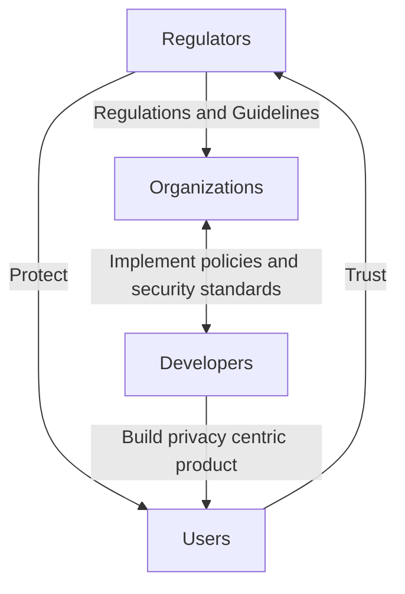
```mermaid
flowchart TD
    GOV[Regulators] -->|Regulations and Guidelines| ORGANIZATIONS[Organizations]
    USER[Users] --> |Trust| GOV
    GOV --> |Protect| USER
    ORGANIZATIONS <--> |Implement policies and security standards| DEVELOPER[Developers]
    DEVELOPER --> |Build privacy centric product| USER
```

The diagram above is indeed an oversimplified ecosystem. It doesn't mention different actors who "glue" these components together such as data protection officers (DPO), auditors and consumer advocatory groups (e.g. [APOCE](https://apoce.org/)). 

If you are interested in this domain in Algeria, I recommend you connect with experts such as [Yazid AGUEDAL](https://www.linkedin.com/in/yazidaguedal), [Djallal BOUABDALLAH](https://www.linkedin.com/in/bjallal), [Tadjeddine BACHIR](https://www.linkedin.com/in/tadjeddinebachir), [Karim Khelouiati](https://www.linkedin.com/in/karim-khelouiati), etc.

## Explaining the Microecosystem

Before I start describing my framework (the Microecosystem), let's align on certain definitions:

- **Data** is the pieces of information, figures and facts about something or someone.
- **Data Privacy** is the right of individuals to control how data is used and shared. It can go from not wanting strangers to know your mother's name, to websites from knowing your real name, birth date, and your gender... **You** have the right to share and not to share/disclose any sensitive information about yourself.
- **Sensitive information** is data that requires protection, and is the data people and organizations want to keep private. They may get harmed if this information is exposed, or handed to the wrong parties.
- **Privacy Policy** is a legal document that outlines how an organization collects, processes, stores, and shares user data. It informs users about their data rights and the measures taken to protect their privacy.

Yes, you can define these terms differently, you can read about them elsewhere, and you **must**. Now, let's continue with our micro-ecosystem:

In a nutshell, YOU as a user of a digital product (website, mobile application, etc), you have rights to share your information with the entity/organization who's behind that product (a company, or an independent developer, etc).

Regulators, the government and other organizations working with them define **users rights**, and create frameworks for companies to operate and deal with users' personal and sensitive information. The Algerian law defines these rights and sets up agencies that work on auditing and making sure that companies are compliant with these laws. Among these agencies, we have [ANDPD](https://anpdp.dz/), [ARPCE](https://www.arpce.dz/), etc.

As a user of of an Algerian product, *you should* trust the government to implement these regulations, to force companies to respect your rights, and to give you a platform where you can complain, or even sue those who are not compliant.

Before you roll your eyes disagreeing with the last sentence, [Wait... Let me tell you something..](https://youtu.be/iIl8aFAeX9Q?t=69): It's not going well, and I will tell you why I think that as a user myself, I don't trust the government with this. Therefore, the first link in our diagram is problematic:

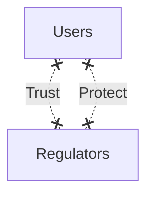
```mermaid
flowchart TD
    USER[Users] x-.-x |Trust| GOV[Regulators]
    USER x-.-x |Protect| GOV
```

If the users don't trust the regulators (the government in our case), or if they're ignorant about their rights. Companies and developers may get away with a lot. Therefore, we may end up with a weaker trust chain, as the following:

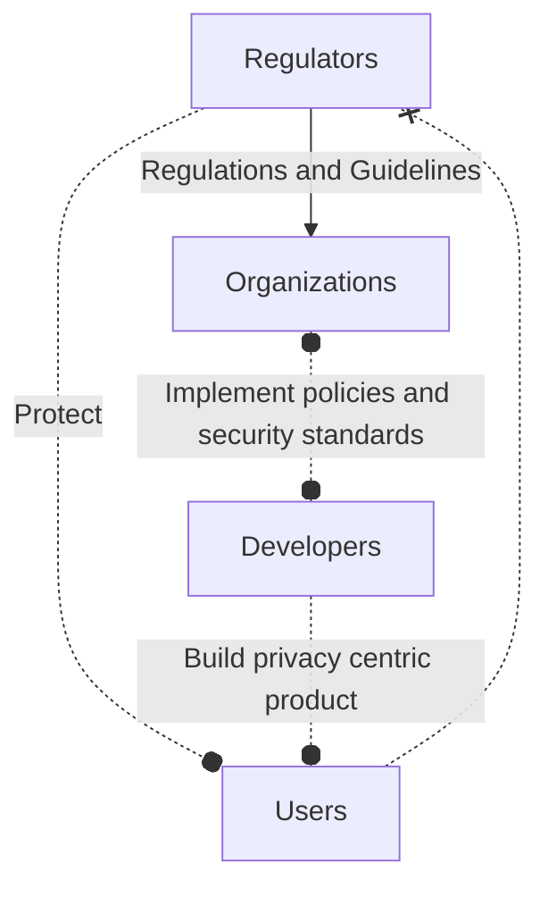
```mermaid
flowchart TD
    GOV[Regulators] -->|Regulations and Guidelines| ORGANIZATIONS[Organizations]
    USER[Users] -.-x GOV
    GOV -.-o |Protect| USER
    ORGANIZATIONS o-.-o |Implement policies and security standards| DEVELOPER[Developers]
    DEVELOPER -.-o |Build privacy centric product| USER
```

It seems that the only link we still have from the initial graph is the relation between government and companies. **Spoiler alert**: It's also not going well, and *maybe*, it's not going at all.

In fact, every node, and every link of that graph is problematic, and it has something wrong about it.

<small>Photo by <a href="https://unsplash.com/@karim_manjra?utm_content=creditCopyText&utm_medium=referral&utm_source=unsplash">Karim MANJRA</a> on <a href="https://unsplash.com/photos/a-rusted-metal-door-with-two-knobs-on-it-CIXQCIEv1JU?utm_content=creditCopyText&utm_medium=referral&utm_source=unsplash">Unsplash</a></small>

## The problems with data privacy within this framework

### The users, and the culture

Coming from a technophobic country that just started digitalization, we might be a little bit behind, maybe some of us don't know how important data protection is.

I remember when I was young we used to rent videocassettes from [videotheques](https://www.algerie360.com/videotheques-location-de-films-une-affaire-qui-marche/), and instead of having some money as a deposit, we just left our ID card. It is terrifying now that I think that I traded my little green ID card for a pirated Jackie Chan movie, not questioning what the guy in the shop (or whoever will replace him) can do with it.

I grew up in an environment where I thought that I could just give my personal identifiable information (PII) to anyone and that I should show my ID to people who claimed to be authorized to see it.

I grew up seeing lists of results for exams hung for hours and days in establishments, with people's personal information.

I grew up in an environment where "unauthorized access" to devices is not a thing, you don't need to be a social engineering expert, you just need to be nice and know how to ask things. And people will accept it and be happy to serve/help you.

We didn't really question our data privacy in that environment. We probably didn't understand why all that is wrong, or why it can be dangerous, even for that scope in the "offline/physical" world, let alone the digital sphere...

#### Why is it a problem?

If I tell you that I have a list of more than 1700 pharmacy students, their first names, last names, and birth dates. Not only that, I have a list of signatures (literally: black on white) of the members of the jury who sign "Résidanats" exams.

You may think how dangerous that can be, how easily I can dox those students.

> *"Doxing or doxxing is the act of publicly providing personally identifiable information about an individual or organization, usually via the Internet and without their consent".* [Wikipedia](https://en.wikipedia.org/wiki/Doxing)

How someone could just use their PII to attempt malicious social engineering attacks on them or use them to attack their organizations (e.g. simply send a named birthday card or an infected USB stick with their name)...

And if someone has the signatures of jury members... They can Photoshop their way through some fraudulent actions.

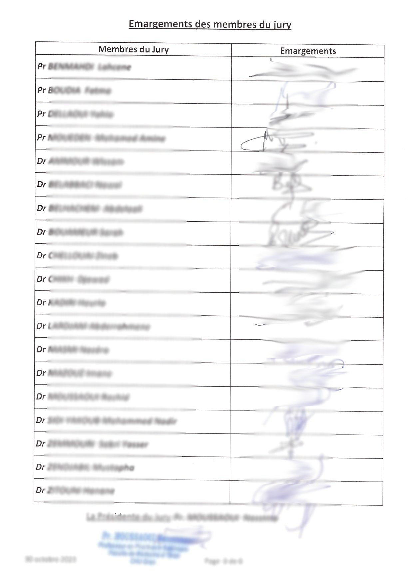

I'm not sure if that sounded alarming, or concerning, or if it sounded like I got an unauthorized access to our faculty of medicine...

In fact, I just saw that on a public post on Facebook. Universities do that to publish "Résidanats" exam results.

 

> When I started writing this blog LAST YEAR, I used that example as one of the worst PII breaches. Then I saw an even more alarming post from the official **Wilaya D'Oran** page.
> 
> 
>
> This post itself was funny and scary at the same time, it was funny because it's unbelievable that such an official page posted a list of 200+ persons, with their photos, full names, date and place of birth, father & mother's names and marital status... Online, publicly, and on Facebook.

 

**Victims** of these data exposures are subject to different threats. Threat actors can impersonate them and use their identities in fraudulent actions; Why would a scammer invent a persona for their attacks when they can use a real person's identity (name, birth date place, etc.).

These victims' reputations might be damaged because of these data breaches, and these people's personal lives are exposed online; Why should anyone know that Mr. X is a candidate for social housing in that area, and that information may affect their personal lives? People don't need to know that Mme Y was a candidate in a certain admission exam and got selected, or not selected, because Mme Y, may need to secure her plan B and apply for a different job, etc.

People on these lists are **victims** as many things can go wrong with their lives because of this leaked information.

"The culture" is so messed up in Algeria, that even more sensitive industries do such practices "for transparency", while they expose themselves as organizations and candidates/employees to major dangers. For example, I found a **public** document on the Algerian customs website for the list of candidates who were selected to pass admission exams. Threat actors may short-list potential customs employees for doxing them and/or infiltrate administrations.

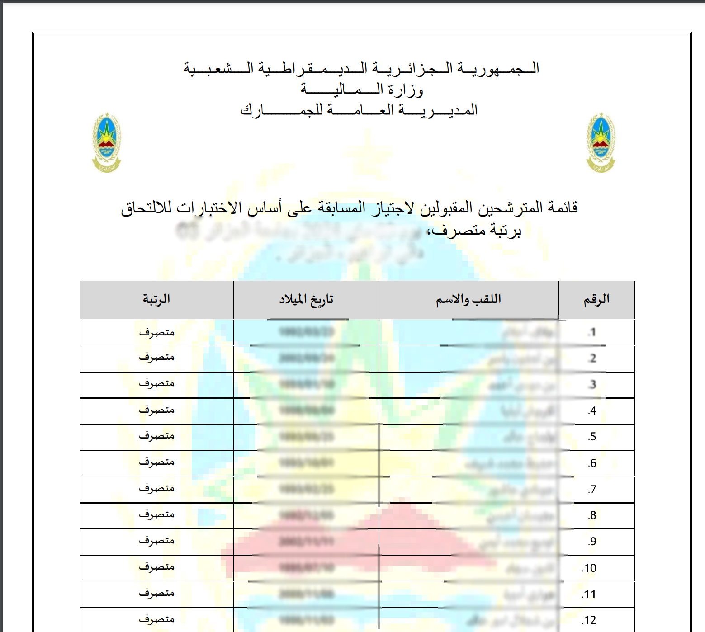

I believe that being transparent is not always stripping yourself naked, publishing lists on websites and on Facebook is not similar to "Tableau d'affichage" inside administrations, people have phones, they have internet, and once something is online, it's for EVERYONE, every person and every bot out there.

People must not share their private information online, offline and online. Organizations must also treat users' information with care and **respect**.

We heard other stories when people's CVs got ignored and thrown in the trash, while most of the Algerian typical templates hold personal & contact information (address, phone number, email addresses, etc). This also happens with all sorts of membership cards such as [this **incident**](https://www.linkedin.com/posts/karim-khelouiati_dgsn-anpdp-activity-7227645338461904896-P3-r) (as Mr Karim did call it).

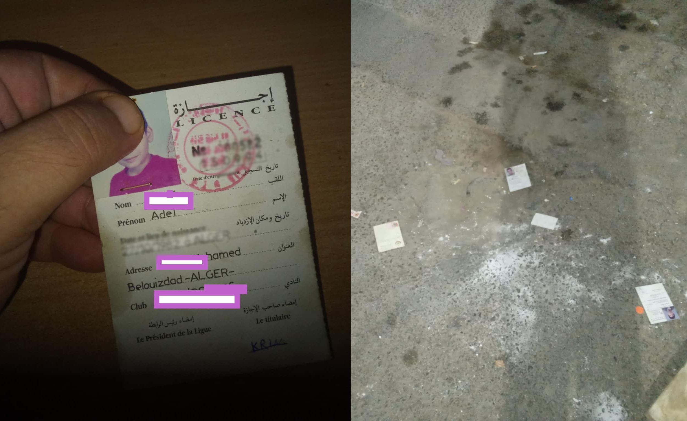

We have to work on our collective "data privacy culture", both for the physical and the digital worlds. Data is Data, and data represents real people and real entities. 
 

With this, we can say that the user in our micro-ecosystem is also a part of the problem.

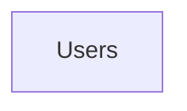
```mermaid
flowchart TD
    USER[Users]
```

As citizens, digital citizens, customers and users, we don't know how to protect our personal data, or we don't really care or think about it. Therefore, we may share our personal and sensitive information carelessly, and we don't mind/notice that companies and organizations we interact with are not careful about our data.

Being ignorant and careless would also mean that we may miss the fact that we can report data-related incidents to the authorities to fix situations or at least make sure that these offenses get penalized.

This brings me to the other problematic point, the problem with authorities.

### The government trying to address these issues à la DZ

As stated before, our tech revolution is led by not only the government but with some experts. These experts brought something to the table, and the government applied it with a classical: Founding "a national authority", or "a committee of X", or as all Algerians are used to hearing " اللّجْنَة الوَطَنيّة".

With the law [N°18–07](https://anpdp.dz/wp-content/uploads/2023/01/2.1-Loi-N%C2%B018-07-2.pdf), and the new National Personal Data Protection Authority (Autorité Nationale de Protection des Données à Caractère Personnel), the [ANPDP](https://anpdp.dz/) was established.

On paper, on media, and multiple online platforms this initiative makes me feel that there is a legal base, there's a political will, and a strong base to start the journey of respecting Algerians' personal and identifiable data.

There are also other associations and organizations working on informing and teaching people about data privacy and their rights. We started seeing more posts online by [APOCE](https://apoce.org/), the [Police's social media](https://www.facebook.com/algeriepolice.dz) and other initiatives like [Salamat](https://portal.salamatmena.org/)

Maybe for once, we can't really blame the government, or at least: Not yet, not for everything. So, why do I think they're also a part of the problem?

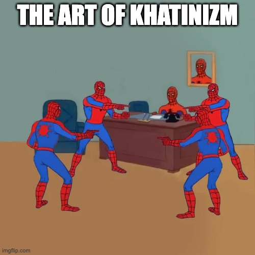

Because I think that the solution has some of **Khatinizm** (`stay tuned for the next blog about "The art of khatinism"`). The government and its ministries outsourced the responsibility to the ANPDP and other agencies, however, when things get murky everyone starts pointing fingers at others, and responsibilities may fall in the cracks between different agencies. That may make holding someone accountable difficult.

That might be a bit harsh of a statement, but that is what I felt when trying to report incidents, or when trying to get something done.

The previous examples earlier, are far from being the only conflict where Algerians' PII is not respected by government agencies themselves.

For example, some official websites do not mention how our data as users are treated, others even have empty Terms and condition pages, such as [Startup.dz](https://startup.dz/conditions-generales/):

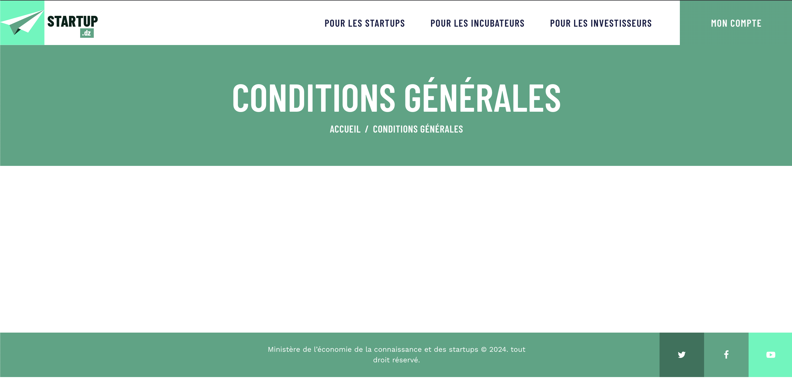

When I wanted to create an account, I was genuinely interested in knowing what information they needed from me and how they will process them, but unfortunately, they still have an empty page for several months now ([Wayback machine link](https://web.archive.org/web/20240000000000*/https://startup.dz/conditions-generales/)).

I also found that some official websites use trackers and analytics tools that work even without users' consent.

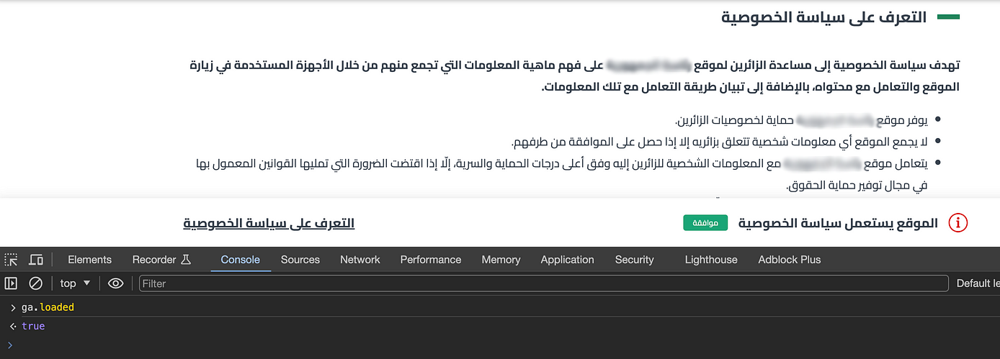

In the example above, I found that [Google Analytics](https://marketingplatform.google.com/about/analytics/) was loaded even before I clicked on the "Confirm button". I thought that this was either a bug or the developer used the wrong word in their cookie consent CTA button. The privacy notes page explicitly says that the website will collect any analytics without the user's consent.

I thought that the website had a bug or an ignored implementation of a consent button that enabled Google Analytics on a government website. So I geeked for a moment and checked their button's event listener, maybe something slipped away from the developers or QA (if they have one). To my surprise, I found even more alarming things...

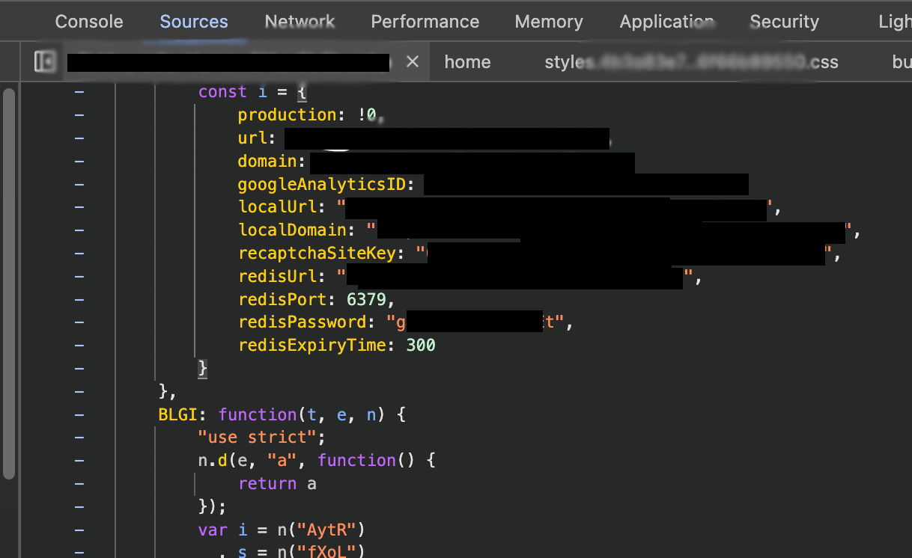
 
The website had so many "questionable" bugs, from hardcoded credentials that are somehow sent to the client, to some APIs that can be abused to over-fetch data, etc.

 

As an Algerian, I do understand the hype and the rush to digitalize everything and to go online for everything. I also see "Passing the Torch to the Youth" initiatives, but I'm a little bit puzzled (to not say disappointed) when I see government and public companies' websites not being the model in respecting Algerian regulations.

As a last example: Here's a chat widget you get when visiting a national bank website... The widget asks the users for their full name, phone number and account number.

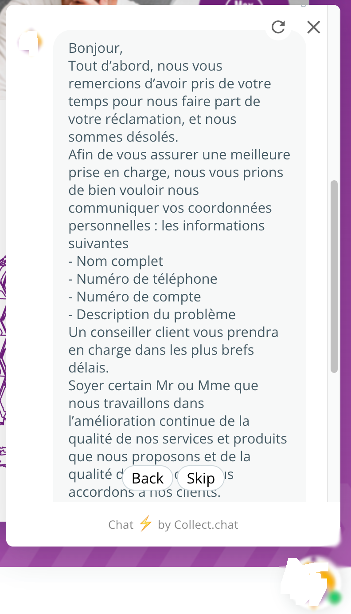

If that doesn't seem bad *enough* for you, let me explain why I believe it is:

The chat widget is from a third-party service ([collect.chat](https://collect.chat/)), and according to their [privacy notes](https://collect.chat/privacy/), their data is hosted in western europe. That means that this bank is using, and asking users to enter data in a service that's hosted abroad. And, it will also ask the users to enter their private information at the very beginning of their support funnel, and it may lead to teaching new users a very bad UX/Security practice of entering private information in such widgets.

These examples make me question: Who's auditing, and who can report such incidents to who?

#### The ANPDP and Co

I had a disappointing experience with ANPDP. I hope I'm wrong, or unlucky or just wrong about them. But let me tell my story:

A national institution opened pre-registration to one of their programs online, and as a curious developer who happened to work on [technology trends in Algeria for my Algerian software engineering report](https://state-of-algeria.dev/docs/insights/technology-trends), I was playing around with some URLs, on my browser (Chill! I used no fancy scanning or pentesting tools).

So I found the following:

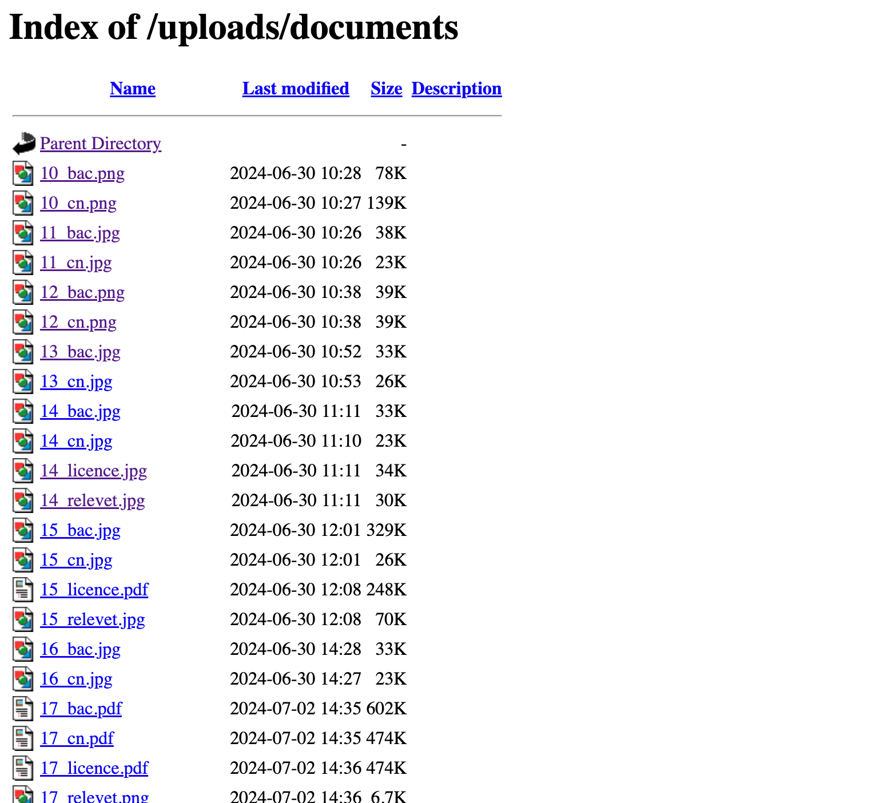

A list of 7000+ participants' documents: A copy of their Baccalaureate, Bachelor's degree and their ID card... Let that sink, for a moment.

I, a random person on the internet could find these. And as a developer who happened to check his logs, I know that the web in 2024 will be full of bots/crawlers, and automated scanners who keep scanning for such low-hanging fruits.

Now, as a good citizen, I wanted to report this incident. So I went to ANDPD's website, I needed quite some time to find the link to [reporting incidents page](https://anpdp.dz/%d8%a7%d9%84%d8%a5%d8%ad%d8%aa%d8%ac%d8%a7%d8%ac%d8%8c-%d8%a7%d9%84%d8%aa%d8%b8%d9%84%d9%91%d9%85-%d9%88-%d8%a7%d9%84%d8%b4%d9%83%d9%88%d9%89/), to find that says "We will later provide a form for reporting and sending complaints through our website". The message is still there after months!

I tried to email them on multiple occasions then I called them on different phone numbers to I got a response, during my call I had to explain what I found and why is it problematic, and then they asked me to send an email to the same address I got no response from. The problem was luckily solved after emailing different organizations (police, ministry of Telecommunications, administrators in that organization, etc).

> *If anyone with relations to ANDPD is reading this: please have a workforce to answer emails, please fix the problem with your [web portal](https://portail.anpdp.dz/), and please explain things better for newbies: What's the information? What do you consider personal identifiable information? How can we report incidents?*
> 
> *And please, publish your findings and let us trust that you are actually auditing incompliant companies.*

That incident and its possible impact reminded me of the news about an Algerian who allegedly joined a "criminal army", and they shared his identity card online. When interviewed, the guy was completely unaware of the news and denied the whole story... Now, how come his face was on foreign media, and different social media platforms (see the story on [Eekad fact-checking platform](https://www.instagram.com/eekadfacts/reel/C74PoDCB_bj/)).

#### Disconnect and unawareness

When interviewing Algerian startups [for the State of Software Engineering in Algeria report](https://state-of-algeria.dev/docs/insights/e-payment-solutions), I learned that many companies in Algeria either don't know about data protection laws, or don't care about it. In [an interview](https://state-of-algeria.dev/docs/appendix/raw-interviews) with a startup that provides third-party payment solutions, the representative told me, I asked about the law N°18–07, and they replied:

> *"The law is still new, and we are still not applying it"*

In other discussions with other companies, we found that some of them have legal experts who are working on making the company compliant with the law.

From what I understood users and organizations are not aware of data protection laws in Algeria, and not aware of the existence of an agency like ANPDP or they don't know what they "can do" exactly. While others choose to ignore and doge the Algerian regulations.

That means that there's another "broken" link in our ecosystem:

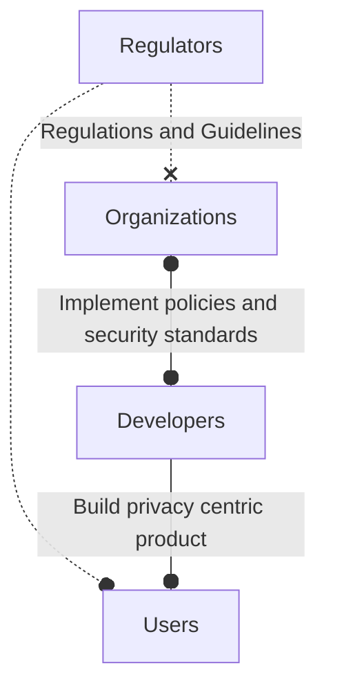
```mermaid
flowchart TD
    GOV[Regulators] -.-x |Regulations and Guidelines| ORGANIZATIONS[Organizations]
    USER[Users] ~~~ GOV
    GOV -.-o USER
    ORGANIZATIONS o--o |Implement policies and security standards| DEVELOPER[Developers]
    DEVELOPER --o |Build privacy centric product| USER
```

### Companies, administrations and startups

Now, purely from an ethical and economical perspective, are companies respecting users' personal data? And we tell a story as we only had this micro-ecosystem instead:

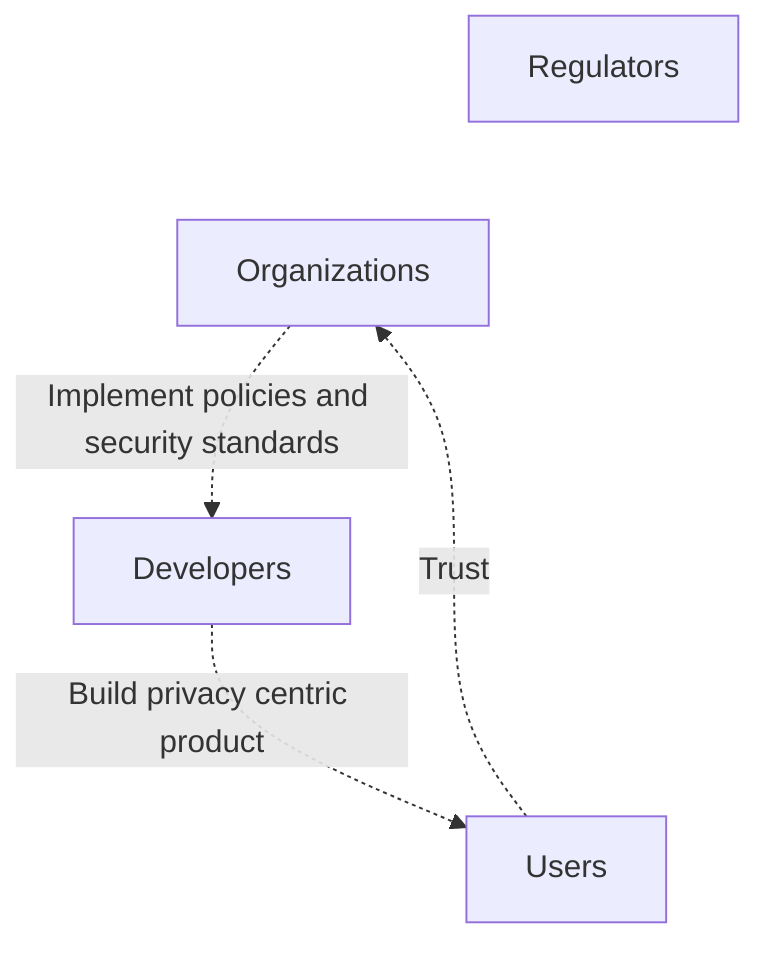
```mermaid
flowchart TD
    GOV[Regulators] ~~~ ORGANIZATIONS[Organizations]
    USER[Users] ~~~ GOV
    GOV ~~~USER
    ORGANIZATIONS -.-> |Implement policies and security standards| DEVELOPER[Developers]
    DEVELOPER -.-> |Build privacy centric product| USER
    USER -.-> |Trust| ORGANIZATIONS
```

 

When you ask companies, you get answers like: "Yes of course", or "the the best we can", or more concerning answers like: "What do you mean by data protection? We use SSL/TLS, <nobr>and use \{Insert a framework, Cloud provider or DBMS here\}"</nobr>.

> So, can we tell that Algerian companies actually know and care about the data privacy of their employees and customers?

This bit is tricky to answer, we can't talk about different companies in this "already long" article. But let me try to keep it short, and hopefully, other experts will dig into this topic further.

For this let's talk about some areas I think are problematic:

#### The culture (again), and training staff

As mentioned earlier, we are a very social and community-driven society. If you need a company's secrets, just sit in cafés where their employees hang out, or if you are a female... I don't know, maybe try to go to meet them at a hairdresser or something.

One of my friends who's also a computer guy told me that some user account in town hall systems (la mairie) is `123456`. Yes, first how did he know? Second, seriously **123456**? Who should change it or tell people how/why they must do it?

Being the geek/the computer guy, I always had people asking me to fix their work computer, or their personal computer that happens to have work-related information. As an unauthorized person, I could easily get information that I was not supposed to have, or I could install malicious software (even without me knowing) that would lead to a backdoor to a whole organization.

... I thought I had enough stories until last month, when we needed to open a support ticket to resolve an issue with a large Algerian cloud service provider, our contact person on *the phone* asked for our VM's IP address, and during the call we had a misunderstanding so they heard a different number so they said: "Are you calling for [~~AN OFFICIAL CULTURAL BUILDING~~]?" The person just handed us, random people, an IP address we were not supposed to know.

Being in the Algerian social environment, you will have a fair share of information about any organization with a minimum social engineering effort/experience.

 

With experience from working for a foreign company, we often perform mandatory compliance and cybersecurity trainings. In our day-to-day job, these trainings are annoying and almost no one of us likes them... But when we think about what can go wrong if we forget about eavesdropping and shoulder surfing and that these things may get people and **organizations** in trouble.

It's unbelievable that some employees in some companies don't know what they should and should not disclose, and how they should treat the company and people's sensitive data.

#### Being accountable and transparent

No one likes public shaming, and no company or employee likes to confess and admit their mistakes.

However, when there's no clear transparency culture to disclose mistakes (such as having data breaches or any security incidents), and when there's no legal obligation to be transparent about these mistakes and take the responsibility to fix damages... Companies and employees will just sweep incidents under the Khatinizm rug.

There were endless data breaches in Algerian companies and government agencies. But to mention some of the ones I personally saw:

This year we witnessed a serious data breach of an Algerian jobs platform, the platform is even used by the [High Commission of Digitalization (working under the Algerian presidency office)](https://hcn.gov.dz/).

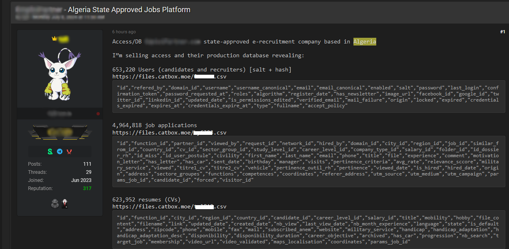

The incident was reported by different activists on different social media platforms, then days after the "noise". The responsible company published an official statement on their Facebook page:

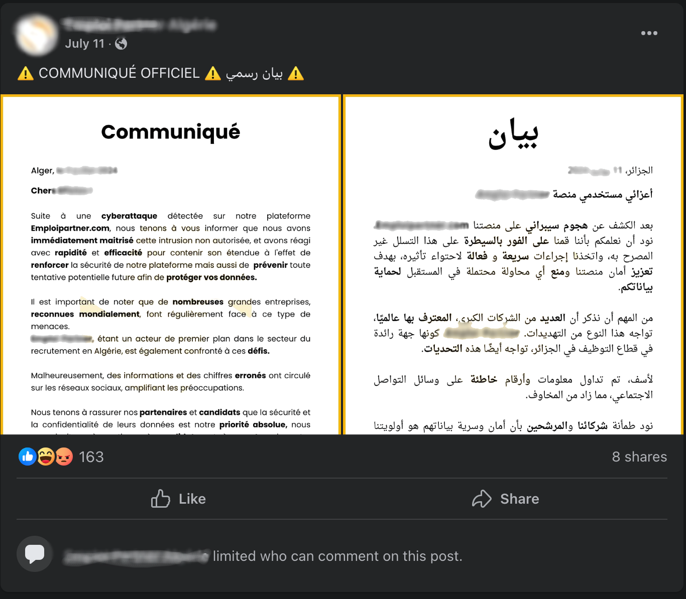

The statement only mentioned that the numbers shared on social media were not correct and that they detected the attack and could stop it. They mentioned they, like all big companies are targeted by cyberattacks.

When I saw the news on social media, I looked up some data breach forums on the dark web. Then I searched in that forum for `Algeria` and `DZ`, and unfortunately, I could find more data breaches... Among the most critical ones was A breach that affected the CNAS (National Fund for Social Insurance for Social Workers):

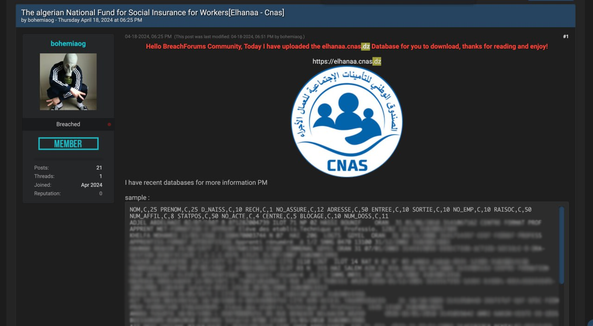

The OP posted a screenshot from what seemed like an internal management software.

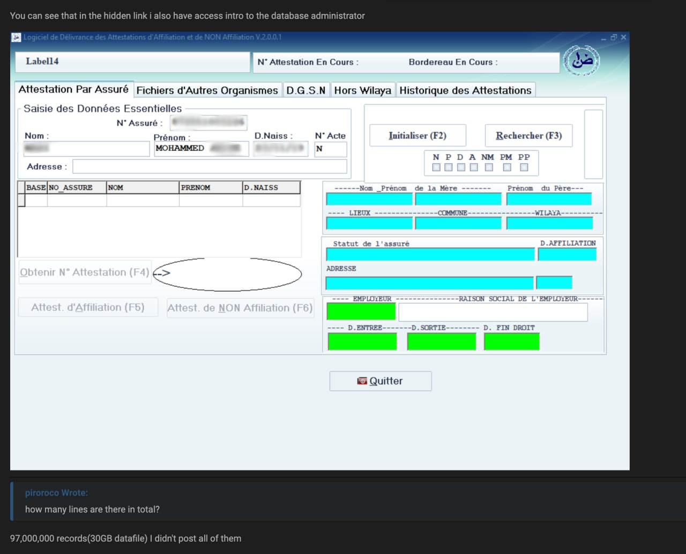 

What's more unfortunate is that we did not hear any explanations from authorities or representatives of this platform.

Same for the platform I mentioned earlier where I could see personal information from 7000+ registered candidates in a national platform. There was no public announcement after that incident.

Notifying victims of data breaches is an ethical and legal obligation, well maybe; I'm not a lawyer but when reading the following:

> *La notification d'une violation des données à caractère personnel à l'intéressé n'est toutefois pas nécessaire si l’autorité nationale constate que des mesures de protection appropriées des données ont été mises en œuvre par le fournisseur*.

In English:

> *Algerian companies are not always required to notify individuals (the "interested party") in the event of a personal data breach if the national authority determines that appropriate data protection measures have been implemented by the provider*

Therefore, if the ANDP decides that the compromised data was encrypted or that it was not personal identifiable data, companies are not always required to disclose these data breaches. But, what do they do when PII data is compromised?

#### ~~How~~ Can we help? Or report/complain?

I wish the question was more about the `How`, then I just post links or How-To tutorials. But, sometimes things might get a little bit more complicated.

When interviewing cybersecurity professionals for [my insights section of "The state of Software engineering in Algeria"](https://state-of-algeria.dev/docs/insights/cybersecurity), I asked `If you want to contribute to Algeria's national cybersecurity mission, would you report vulnerabilities you find in Algerian websites? Did you do it?`

The answers were mostly negative, Algerian engineers and experts in the IT field almost had the same answer: `Akhtik(أخطيك)/Khatini(خاطيني)` which means `Stay away from that / I'm staying away from that`. Since there are no clear ways to report issues, and we find a way, we'd be risking a lot if we report them.

I heard stories of people who were interrogated by the police and faced serious problems after they reported vulnerabilities to companies, and then these companies reported these people.

Even if a stubborn person like me tries his luck, and wants to report problems, it might not be the easiest... I personally tried to email and call companies, the ANPDP, APOCE and other authorities to report an incident I mentioned earlier. In other cases, I just used my network and tried to find a person who knows a person to get them to fix something.

> **💡TIP (based on a story from someone):** Be careful not to propose your consulting services to fix it, as this might be considered as an intentional sabotage or a ransom.

 

Also, as mentioned earlier in this article. The ANPDP's reporting systems might not be caught up at the moment of writing this article.

However, the agency looks promising and we must keep on trying to use them to report data breaches. 

Consumer advocacy groups like [APOCE](https://apoce.org/) can also be used to report such incidents and let them use their networks to get victims' rights and/or compensate them.

We as consumers and users of digital products should know our rights, and know where and how to report companies that don't respect our data privacy. And it's on companies, on organizations and companies, on schools and on initiatives like [Salamat](https://portal.salamatmena.org/) to educate us about such things.

 

Back to our micro-ecosystem. As an Algerian user of digital products from Algerian companies, I don't trust any of them, partially because of the culture in the companies, and compliance with regulators. Now we're left with the following:

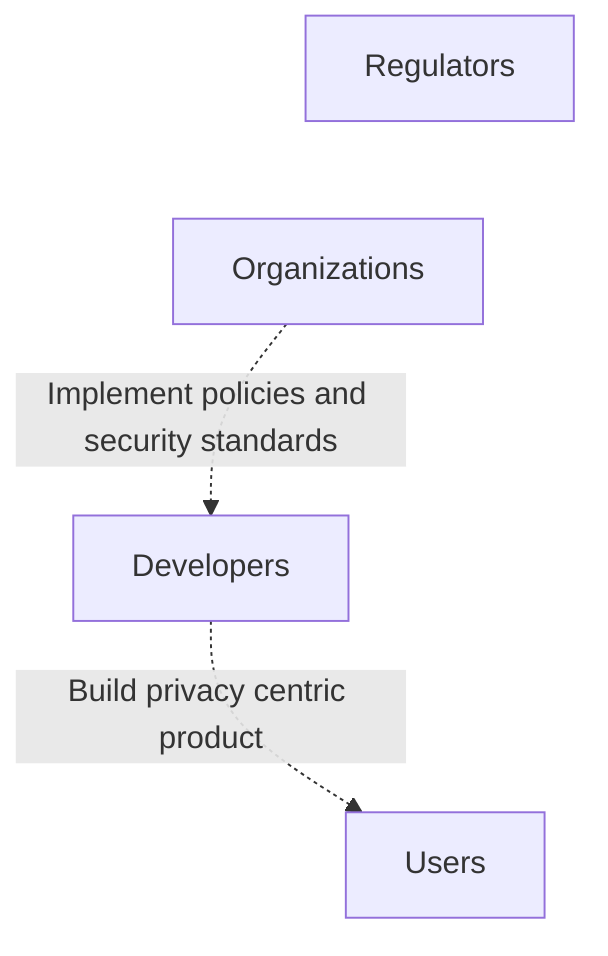
```mermaid
flowchart TD
    GOV[Regulators] ~~~ ORGANIZATIONS[Organizations]
    USER[Users] ~~~ GOV
    ORGANIZATIONS -.-> |Implement policies and security standards| DEVELOPER[Developers]
    DEVELOPER -.-> |Build privacy centric product| USER
    USER ~~~ ORGANIZATIONS
```

The only two links we still have in the system are the organization/company to developers and developers to users. That brings us to our last persona to blame.

### The developers

If other pieces of the privacy and data protection ecosystem are still lagging behind, or maybe undermine its importance... Can we, the developers save the show? Or at least save what we can from it?

Is it safe to say that Algerian developers care about data protection when building their production-grade software? If so, are they doing it because their companies' policies are forcing it, or because of their ethics and training/education?

 

> **TLDR/مْ-لخّر;** It is another [Chekchouka](https://en.wikipedia.org/wiki/Shakshouka). Sometimes developers don't care to build privacy-by-design products, and sometimes companies/clients want to rush things and ask to build quick & dirty solutions, and sometimes... It's a skills issue.

 

As developers, we like to think that we're smart just because we do things others don't understand, and think they are hard. And with that, we can be naïve and ignorant, we can have a false confidence that may hide some of our incompetence.

And sometimes, we are a little bit hyped up. With all bootcamps, startups trend and all events and posts and reels on social media everyone wants to be a developer or hire one... And that might be causing inevitable problems.

To start with another example; A couple of years ago, a big influencer in the country launched an e-shopping application. That made some noise, which made me curious... Who made it? What stack they're using, etc.

A couple of minutes of "playing" with the application we found out that they use GraphQL for their API, and the developer who worked on it left his API unprotected and even the GraphQL playground enabled.

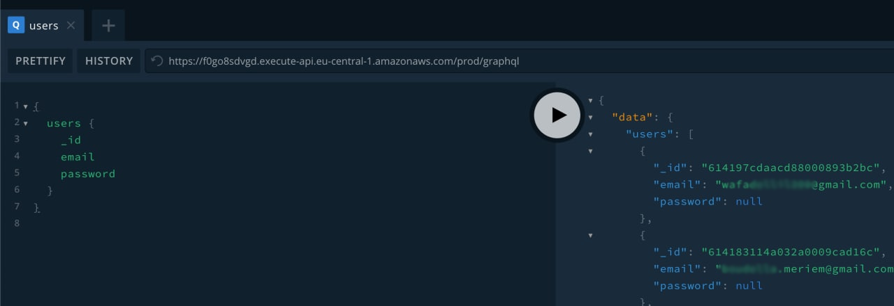

> Don't bother to check the link, that AWS instance is down now.

We could fetch their users' and partners' data by querying their public endpoint (with autocompletion enabled).

The application has a pattern we saw a lot: Nice applications following best practices, then a bunch of spaghetti code and hacky things. This smells like someone bought or downloaded a white-labeled solution and tried to rebrand it or build on top of it.

In that finding (and many others) we found that developers tested on production, and we found plenty of fake accounts (the developer using his name multiple times)... That also makes us question their skills and ethics when it comes to best practices.

Let me break it to you: **A developer cannot be lazy**. There's no evidence that your favorite tech mind said it.

At this point of the article, I don't want to add another subtitle of `The culture (yet again)`, and talk about the Algerian culture of being lazy, always looking to cut corners and wanna-be quick-witted aka. `قافز/شاطر`.

Some topics in the software industry are well documented, they have patterns and best practices around them, and the internet is full of them, and sometimes of their checklists to make sure that everything is in place. Trusting the tools we use ignoring these controls and cross-checking them should not be ethical or professional from our side.

However, many basics of programming, best practices and security might be missing in newer generations of developers. Some of the developers are AI-powered developers, bootcamp graduates, or people who got fresh and motivated out of university with no practical work experience.

These programmers may end up working for companies and startups or founding their own... Therefore, if there's no mentorship from seniors and/or no will from the company to keep high standards when it comes to software safety and security, these developers may grow in their roles with some serious gaps.

But sometimes, developers and security engineers do care, and try to set high standards: They do value data privacy and security and try to respect it. However, they may face some challenges or pushback from their companies.

In an interview with a security engineer, I was told that sometimes companies ask "to just sign off" things and make controls and audits pass even if they have some findings. That sounded like an administrative person decided to dismiss a technical finding for whatever reason.

This may also happen in startups, both in Algeria and abroad, where people bend some rules to move fast and hope that regulators don't catch them. In Algeria, companies feel safer in that regard.

As mentioned earlier in the article, some companies in Algeria don't care or don't even know about the law N°18–07, therefore, their developers might not be obligated to focus on this, but on their business deliverables.

 

Even if it's a chain, I'd blame developers more, because I'm one of them. And because I saw that sometimes we mess up for stupid reasons.

The older generation of developers had (and some still have) a weird philosophy of building things from scratch and a [NIH](https://en.wikipedia.org/wiki/Not_invented_here)-powered approach. Unfortunately, these developers or as they're called "L'informaticien" still exist, and still work or lead projects... 

Some people with that mentality (sometimes not even with that old generation) do build applications from scratch, either because they think it's easier and safer to build. Or because they don't know that sometimes frameworks and tools do the heavy lifting and take care of some of the most common security vulnerabilities.

> When I wrote the previous paragraph, I wanted to add a screenshot from one of the findings I saw in the last months and years... The finding was from a company that provides car maintenance services, where their website was poorly designed. They had a public endpoint where customers could just provide a car licensing plate to get all information about the client and the car. This is bad... 
>
> But I wanted to push it even further, I wanted to prove my point that doing things from scratch is usually not a good idea, so I started playing with their endpoints, I of course found an **SQLi**, because who would waste time validating inputs?
>
> Then, I saw a login page... Unfortunately, I could bypass it with the very first payload I copied from [hacktricks](https://book.hacktricks.xyz/), there where I saw even more concerning things:
> 
> 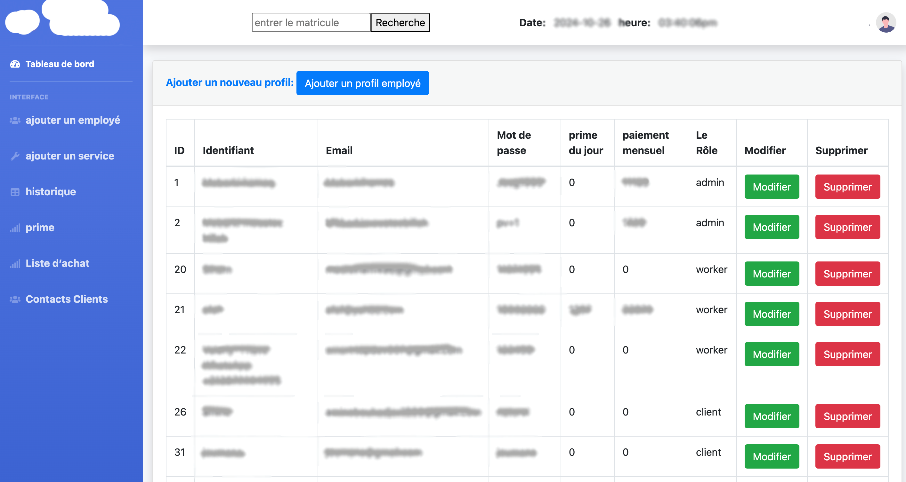
>
> That website, was not the first one of its kind. It's not the first time we've found a website built from scratch, therefore missing some of the security practices that are usually taken care of by libraries and frameworks. It's also not the first website that omits some privacy best practices, for example: When accessing the dashboard we could see passwords in plaintext (it is wrong to store passwords unencrypted!). We could also see some weak passwords that could be easily guessed with effortless brute-forcing.
>
> **N.B:** I called the owner of that company's website, who happened to be one of its developers and informed him about the exploits I found. I hope he doesn't sue me though :)

 

On another extreme, we have the toolcoholics, the frameworkers who are often Youtube and Bootcamp graduates. These are the newer generations of developers who learned enough about programming to build websites and applications with certain technologies. The efficiency and confidence they get from their tools sometimes can be dangerous, as they start missing on certain concepts, or they may cut corners when it comes to integrating things with their framework of choice.

It is unfortunate that some of us, still lack understanding or awareness of some security principles and threats, as well as compliance and privacy-related topics.

Some of the practices must be taught in schools, in meetups, and on social media and any other platform. We must be aware of certain regulations, recommendations and best practices.

## What's next for us?

We can't fix the ecosystem as every piece of it is evolving, and the more exposed we are to technology the higher the risks our data privacy is exposed to.

However, every one of us can fix a piece of it, or at least: Spread awareness. Therefore, the first recommendation/idea I'd give is to just **keep talking about the topic**. Just open debates and let people ask and learn or challenge things.

Consumers, or as we named them "Users" in our model, have to be informed and taught about the risks they face when their data is mishandled, and about their rights and responsibilities.

Regulators must be firm when it comes to these topics, and fair in their judgment with everyone. They have to audit and penalize all organizations who mishandle data, whether they're private, public or even other government agencies.

They should also invest in organizations and associations to spread awareness, and to improve their websites to answer questions citizens have, provide easy-to-use platforms to raise concerns, and **have actionable feedback on them**!

Companies on their end, must respect their ethical duties in protecting data, they have to be responsible and transparent with both regulators and their customers. They have to hire or at least work with the right people to do these things and take them seriously.

Some lawyers and legal consulting firms started offering these technical consulting services, and we hope to see more of them. We hope that companies start working closely with them.

We hope to see that companies work proactively with auditing companies to make sure their systems and processes are in line with the law, and with their customers' expectations.

And for us, the developers, we are customers so we must know our rights and other customers' rights. We must speak up and report incidents when we find them, to the right people. We either need to escalate within our companies or report breaches to the authorities. It is a moral duty.

We must learn about best practices, and be mindful when designing our applications. Really, it is fun to build Privacy-by-design and/or Security-by-design systems. Let us enjoy that process instead of seeing that as a bottleneck or as something to be done "after delivering the product", we all know that it would never happen, and when it does it'll never be easy to "secure" a running application.

## $whoami

I'm Abdeldjalil, an Algerian software engineer. In my career, I dealt with GDPR-related topics. I learned from some "annoying" users to read Privacy notes on the website and to demand my rights. I found vulnerabilities and data breaches in some Algerian websites and tried to report them to their owners or the authorities.

For months I worked on [The State of Software Engineering in Algeria](https://state-of-algeria.dev/), a report based on a survey and interviews and a lot of research to assess the state of software engineering in Algeria. Where we tackled different topics (salaries, challenges, remote work, cybersecurity, etc).

I value people's privacy and want to contribute to a culture of writing responsible and respectful software. Sometimes by writing and talking about this topic. And sometimes by building darja-inspired tools like: [hamid.js](https://github.com/Fcmam5/hamid.js), [jelban.js](https://github.com/Fcmam5/jelban-js), and soon: Karkabou.

:::tip
Karkabou is a Django application, intentionally made vulnerable & not respecting best practices when it comes to data protection.

I'll probably rewrite it in a different language or a framework if the community likes the idea :)
:::

*Thank you for reaching this point of the article whether by reading, scrolling or letting your AI friend summarize it for you. I hope we start to continue talking about this topic and help to improve the Algerian tech scene*

 

<small>Thumbnail image credit: <a href="https://unsplash.com/@blueswallow?utm_content=creditCopyText&utm_medium=referral&utm_source=unsplash">Parastoo Maleki</a> on <a href="https://unsplash.com/photos/brown-padlock-on-blue-wooden-door-lkVauaqa__M?utm_content=creditCopyText&utm_medium=referral&utm_source=unsplash">Unsplash</a></small>
