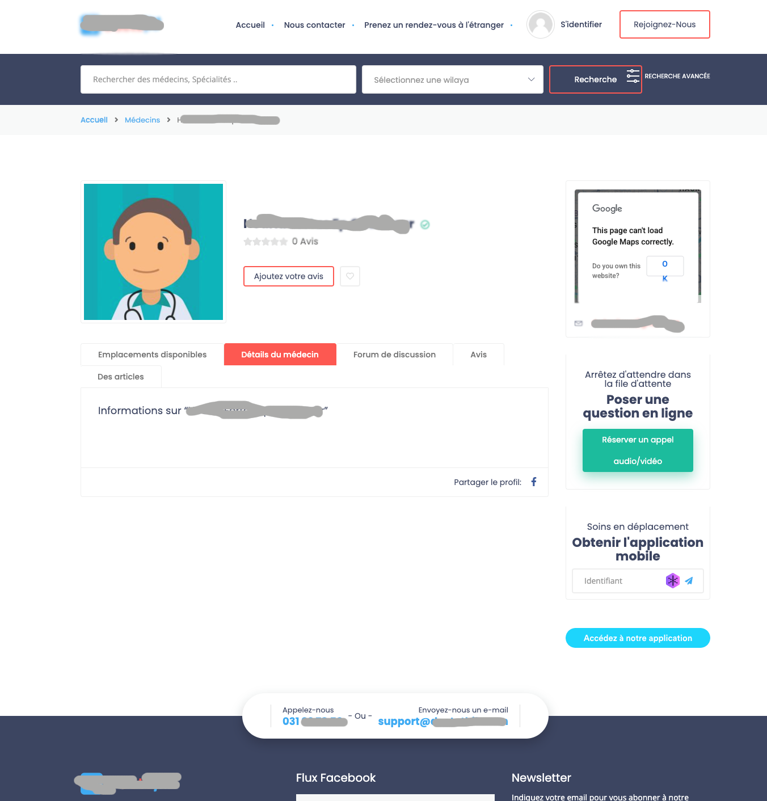
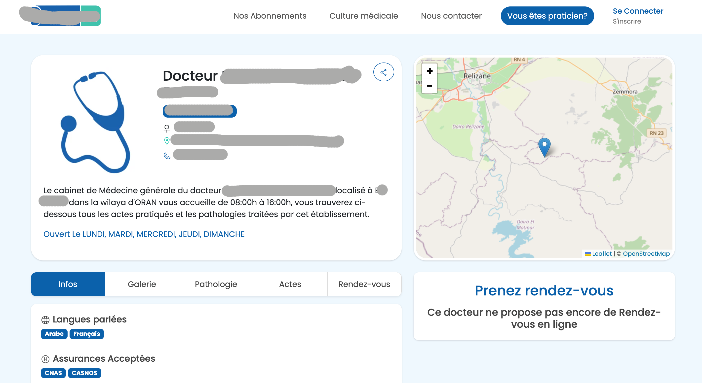
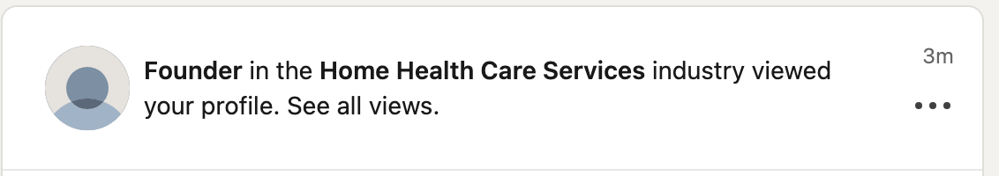

# Adventure with Algerian platforms

In this page I'll share an adventure with some Algerian platforms.

:::tip

You can browse my other [article about **my thoughts about data protection in Algeria**](/dz-blog/data-protection-dz-imo)

:::

## Update 1: Discovering exposed PII on some Algerian platforms (06.02.2024)

One one my relatives (a doctor) found their personal data (name, email, postal address and phone number) exposed on at least two Algerian doctors listing websites.

<!-- truncate -->

### Site 1



Initially, I emailed the first platform with their `support@XYZ` email. But it seems that the email address is invalid (I got the following when emailing them):

```
Your email could not be delivered to one or more recipients.
See below for the delivery error and email.

The most common reasons for undelivered email are wrong recipient address or wrong configuration on the recipient mail server.
```

On the same day, I contacted the ANPDP via `contact.anpdp@anpdp.dz` as their reporting platform is still not available, I still see the following ([snapshot from Wayback machine](https://web.archive.org/web/20250206122252/https://anpdp.dz/%D8%A7%D9%84%D8%A5%D8%AD%D8%AA%D8%AC%D8%A7%D8%AC%D8%8C-%D8%A7%D9%84%D8%AA%D8%B8%D9%84%D9%91%D9%85-%D9%88-%D8%A7%D9%84%D8%B4%D9%83%D9%88%D9%89/)):

```
ستضع السلطة الوطنية لاحقا تحت تصرّف الشخص المعني استمارة مُخصّصة لتقديم الاحتجاج أو التظلّم أو الشكوى على مستوى موقعها الالكتروني. www.anpdp.dz .

سيتم لاحقا نشر كيفيات تحويل الاستمارات و تقديم الاحتجاجات و التظلّمات و الشكاوى.
```

### Site2



The second website belongs to a company who has the [Algerian Startup label](https://startup.dz/), I contacted them on LinkedIn, and by email (I got the address from their contact page).

Few minutes later, I saw that someone from their platform visited my profile on Linkedin:




Let's see how fast (and serious) they'll handle my request before I escalate it.

## Update 2: Site2 Deleted the page; Site1 said they'll look into it (06.02.2024)

### Site1

I found that they have a Facebook page, I sent them a message on Facebook.

Few hours later, I got an answer from them on Facebook saying that they just read my email, even though I got an automated response from my email client that their address doesn't exist:

```
550 No such recipient here (in reply to RCPT TO command)
```

So I assumed that they meant my message on Facebook. Then they said:

> Nous venons de lire votre mail,
> 
> Et nous porterons les vérifications nécessaires pour vous répondre 
> 
> Si Votre ~~`XXX`~~ est répertoriée sur notre plateforme cela ne constitue pas une infraction du moment que ce sont des coordonnées publiques et déjà affichées sur internet
> 
> Les patients ne peuvent pas prendre de rdv sur notre plateforme du moment que le médecin n'y est pas abonné
>
> Par ailleurs la création de profile a du être faite suite au passage d'un de nos délégués au sein de son cabinet
>
> Nous procéderons a une vérification dimanche et reviendrons vers vous


Then, they said that they used publicly available data, and if the person is listed on their website, means that it was registered following the  visit of one of our representatives.

### Site2 

Few hours after reporting the issue to "**Site 2**", they deleted the page/entry from their website. But it still appear on Google searches (I explicitly asked to remove the entry from their databases, mailing-lists and all search results).

For now, I wouldn't request that on my own [from Google](https://support.google.com/websearch/answer/11080680?hl=en) and other search engines, let's see if they will fulfill this request, and if they will get back to me! At this point, I didn't have any ACK or any notification that my query has been received and that they are working on it.

To clarify this further more: I did ask them to confirm once they remove the data I requested.

